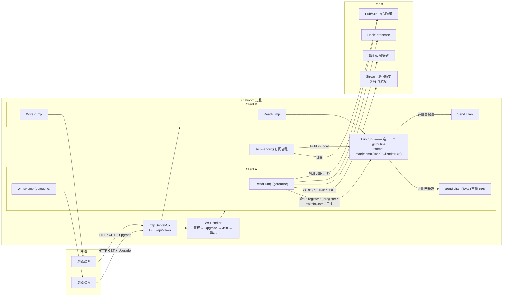
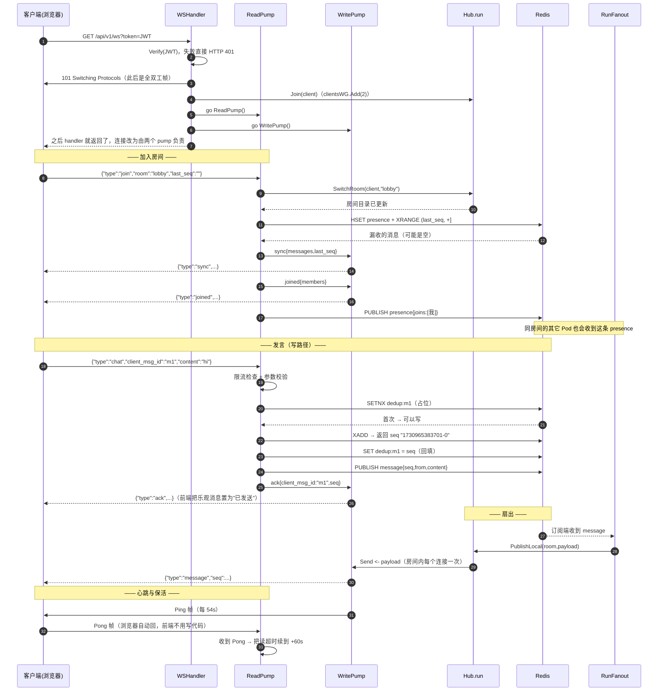
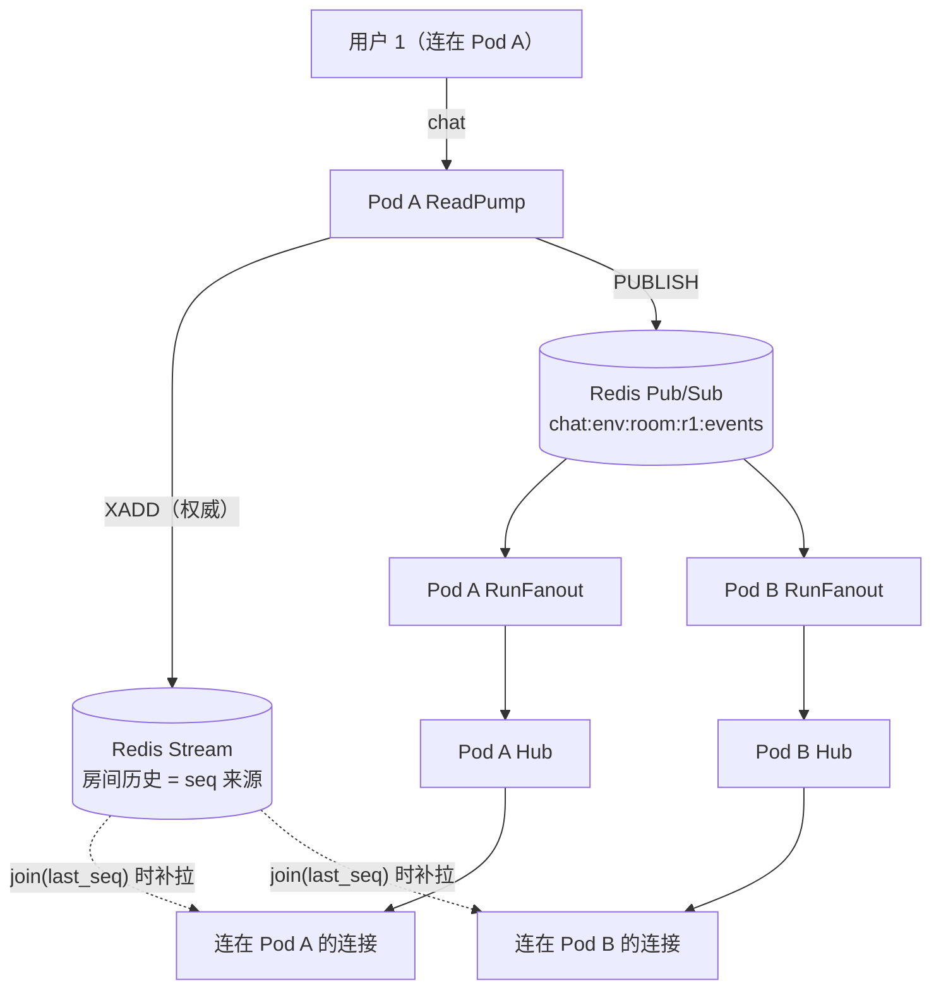
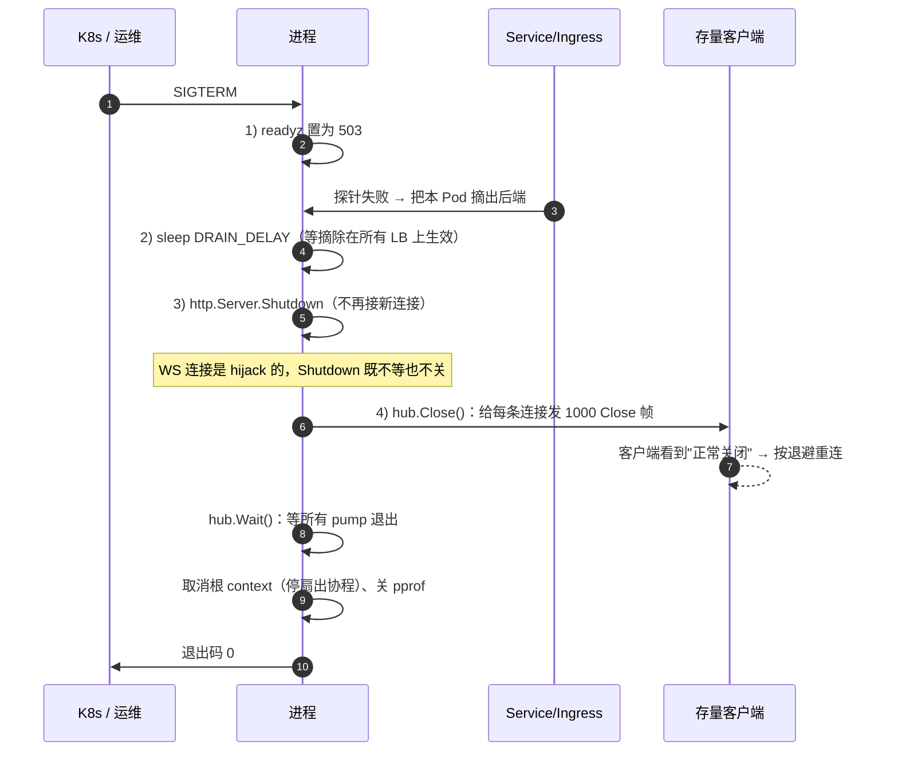
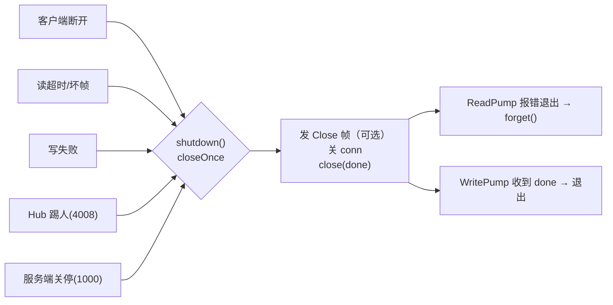
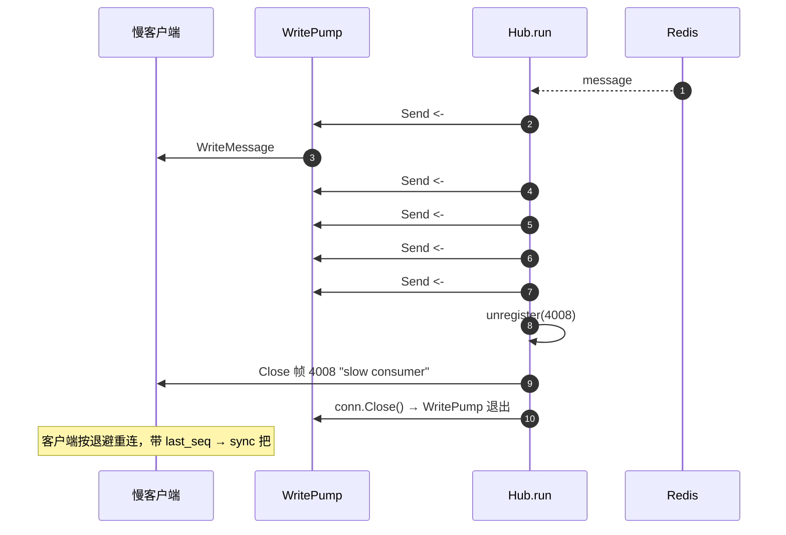
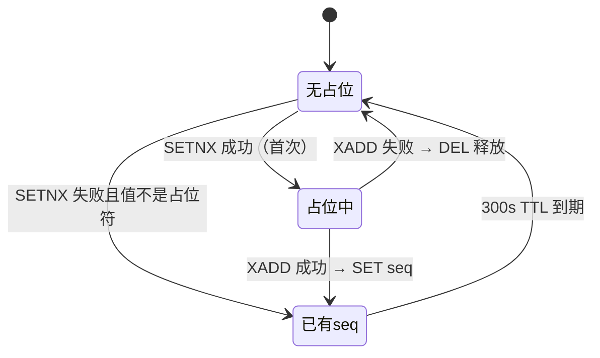
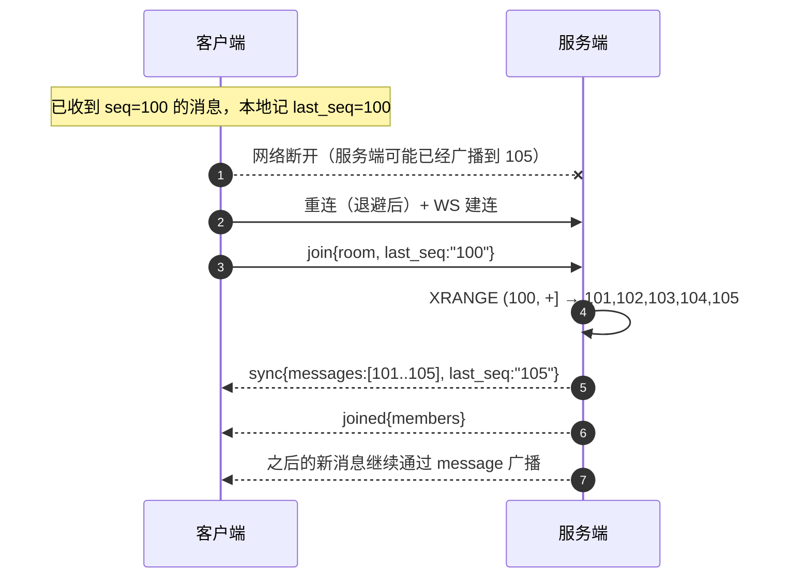

# explain.md —— 从零吃透这个聊天室

> 目标读者：**会一点点 Go**（看得懂 struct、goroutine、channel 的语法，但没写过并发服务），
> 想彻底搞明白这个项目"为什么这么写"的人。
>
> 读完你应该能：给别人讲清楚 Hub 存在的必要性、扇出在放大什么、一条消息从键盘到对方屏幕
> 经过哪些环节、断线重连为什么不会丢消息，并且能自己动手改坏它、修好它、压测它。

---

## 目录

- [0. 怎么用这份文档](#0-怎么用这份文档)
- [1. 先搞清楚：聊天室到底难在哪](#1-先搞清楚聊天室到底难在哪)
- [2. 全景图（最重要的一章）](#2-全景图最重要的一章)
- [3. 为什么要设计一个 Hub？](#3-为什么要设计一个-hub)
- [4. 扇出（fanout）到底是什么？](#4-扇出fanout到底是什么)
- [5. 双 pump 与连接的生命周期](#5-双-pump-与连接的生命周期)
- [6. 消息可靠性：seq、last_seq 与幂等](#6-消息可靠性seqlast_seq-与幂等)
- [7. C/S 协议逐条解剖](#7-cs-协议逐条解剖)
- [8. 分层与依赖方向](#8-分层与依赖方向)
- [9. Redis 存储设计](#9-redis-存储设计)
- [10. 可观测性与调试](#10-可观测性与调试)
- [11. 新手阅读路线与动手练习](#11-新手阅读路线与动手练习)
- [12. FAQ：20 个"为什么"](#12-faq20-个为什么)
- [13. 术语表](#13-术语表)

---

## 0. 怎么用这份文档

**三种读法**（建议按顺序来一遍，之后按需回查）：

| 阶段 | 读什么 | 配合做什么 |
| --- | --- | --- |
| 第一遍（约 1 小时） | 第 1、2 章。只看图，不求看懂代码 | 启动项目，用两个浏览器/客户端互聊一次 |
| 第二遍（约 3 小时） | 第 3–7 章，对照代码读 | 打断点、加日志，跟着一条消息走一遍 |
| 第三遍（约 1 天） | 第 8–12 章 | 做第 11 章的练习（含"故意改坏"实验） |

**你需要的前置知识**（缺哪个补哪个，都只要 10 分钟）：

- `goroutine` 与 `channel` 的基本语法（`go f()`、`ch <- v`、`<-ch`、`select`）
- struct / 方法 / 接口（Go 的接口是隐式实现，这点在本项目里很关键，见第 8 章）
- `context.Context` 是用来取消和传递超时的
- 听说过 WebSocket 是"全双工长连接"就够了，细节本文会讲

**一句话总览**：

> 这个项目本质上在解决一个问题：**如何把一条消息，安全、便宜、不丢地复制给成千上万个速度参差不齐的连接。**

HTTP 接口、JWT、房间、Redis 都是配角。主角是两个东西：**Hub（状态的唯一拥有者）**和**扇出（一次输入变 N 次输出）**。

### 代码地图

| 路径 | 一句话职责 | 对应 guide 章节 |
| --- | --- | --- |
| [cmd/server/main.go](<cmd/server/main.go>) | 装配所有零件 + 优雅关停（顺序很重要） | 3.4 |
| [cmd/server/pprof.go](<cmd/server/pprof.go>) | 内网调试端口 | 2.9 |
| [internal/chat/hub.go](<internal/chat/hub.go>) | **Hub：房间目录 + 投递中心** | 2.2 / 3.2 |
| [internal/chat/client.go](<internal/chat/client.go>) | 一条连接的两个 pump（读/写） | 1.4 / 3.3 |
| [internal/chat/handlers.go](<internal/chat/handlers.go>) | 上行消息的业务处理（join/chat/…） | 3.3 / 4.4 |
| [internal/chat/types.go](<internal/chat/types.go>) | Client 结构、连接接口、关闭与踢人 | 1.6 / 3.1 |
| [internal/chat/ports.go](<internal/chat/ports.go>) | **对外部存储的接口定义**（依赖倒置） | 0.4 |
| [internal/chat/fanout.go](<internal/chat/fanout.go>) | 跨 Pod 扇出的订阅协程 | 4.4 |
| [internal/chat/options.go](<internal/chat/options.go>) | 所有可调参数与默认值 | 1.5 / 2.3 |
| [internal/chat/protocol.go](<internal/chat/protocol.go>) | 上下行 envelope 与错误码（纯数据结构） | 5.4 / 5.5 |
| [internal/chat/metrics.go](<internal/chat/metrics.go>) | Prometheus 指标 | 2.9 |
| [internal/store/store.go](<internal/store/store.go>) | Redis：历史、幂等、presence | 4.1–4.3 |
| [internal/store/fanout.go](<internal/store/fanout.go>) | Redis Pub/Sub → 订阅接口的适配器 | 4.4 |
| [internal/store/room.go](<internal/store/room.go>) | 房间元数据与索引 | 4.1 |
| [internal/api/ws.go](<internal/api/ws.go>) | WS 入口：鉴权 → Upgrade → 起连接 | 1.3 |
| [internal/api/router.go](<internal/api/router.go>) | 路由表（REST + WS + 探针） | 5.2 |
| [internal/api/handlers.go](<internal/api/handlers.go>) | REST handler | 5.3 |
| [internal/api/middleware.go](<internal/api/middleware.go>) | JWT 中间件 | 5.1 |
| [internal/room/service.go](<internal/room/service.go>) | 房间业务（列表/创建/成员） | 4.1 |

---

## 1. 先搞清楚：聊天室到底难在哪

### 1.1 HTTP 与 WebSocket 的根本差别

| | HTTP | WebSocket |
| --- | --- | --- |
| 生命周期 | 一问一答，毫秒级 | 几分钟到几天 |
| 谁主动 | 客户端 | 双方都能主动推 |
| 服务端状态 | 无状态，请求之间互不相识 | **连接即状态**：`*Client` 对象在内存里活着 |
| 进程重启 | 客户端无感（重发即可） | 所有人一起掉线 |
| 数量级 | 每秒万级请求 | 十万级**常驻** goroutine 与 socket |

这句话请记住：**HTTP 的瓶颈是"每秒多少请求"，WS 的瓶颈是"同时挂住多少条命"。**

### 1.2 四大难点（以及天真写法会怎么死）

**① 连接即状态**

每条连接至少占两个 goroutine（读、写）+ 一份 TCP 发送缓冲 + 我们自己的队列。
10 万连接 ≈ 20 万 goroutine、几十 GB 潜在内存。任何"重启一下"都是全体掉线。

**② 广播放大**

1 条消息要写 N 次（N = 房间人数）。1000 人房间、每秒 10 条消息 = 每秒 1 万次网络写。
天真写法（每条连接各自 JSON 序列化 + 直接写）会把 CPU 和 GC 也放大 N 倍。

**③ 背压与公平**

客户端的网速参差不齐。一个网速 10KB/s 的手机 + 一个刷屏的房间 = 消息在服务端堆积。
天真写法（`for c := range clients { c.conn.Write(msg) }`）里，**一个慢客户端会把整条广播路径堵死**，
而广播路径往往正是"所有房间共用"的那条 → 一处慢，全服卡。

**④ 部署有状态**

K8s 假设 Pod 随时可杀、随意扩缩。但连接绑定在具体 Pod 上：滚动更新、缩容、OOM Kill
都会一次性切断一批用户。必须设计"排水 + 让客户端重连后能补齐消息"。

### 1.3 先定义名词（后面反复用）

| 名词 | 含义 |
| --- | --- |
| **Hub** | 进程内的"房间目录 + 投递中心"，是一个只被单独一个 goroutine 修改的对象 |
| **Client** | 一条 WS 连接在服务端的代表（含用户信息、房间、下行队列） |
| **pump** | 一条连接的两个常驻 goroutine：`ReadPump`（读）、`WritePump`（写） |
| **扇出 / fanout** | 一次输入变成 N 次输出（本文第 4 章主角） |
| **背压 / backpressure** | 下游处理不过来时上游怎么办（阻塞 / 丢弃 / 降级） |
| **presence** | "谁在线"这份状态（不是历史消息） |
| **seq** | 消息在房间内的唯一且单调递增的序号（Redis Stream ID） |
| **幂等 / idempotent** | 同一个操作做多少次，结果都一样（重试安全） |
| **排水 / drain** | 关停时先摘流量、再等存量连接优雅结束 |

### 1.4 全局角色表（谁生产、谁消费）

| 角色 | 生产什么 | 消费什么 |
| --- | --- | --- |
| 浏览器 | 上行 envelope（join/chat/typing…） | 下行 envelope（sync/joined/message/ack…） |
| `ReadPump` | Hub 命令（register/unregister/switchRoom） | WS 文本帧 |
| `Hub.run` | 往各连接的 `Send` 投递字节 | Hub 命令、广播单元、房间事件 |
| `WritePump` | WS 文本帧 / Ping / Close 帧 | 自己连接的 `Send` |
| `RunFanout` | `PublishLocal`（把 Redis 的消息交给本地 Hub） | Redis Pub/Sub 消息、房间事件 |
| Redis | Stream ID（= seq）、presence、广播 | 上游写入、订阅拉取 |

---

## 2. 全景图（最重要的一章）

### 2.1 进程内全景：零件怎么连起来



同一张图的纯文本版（万一你的编辑器不渲染 Mermaid）：

```text
浏览器A ──HTTP Upgrade──┐
                        ├─► ServeMux ─► WSHandler ─► 建 Client A / Client B
浏览器B ──HTTP Upgrade──┘                              │
                                                       ├─ ReadPump ──(命令 channel)──┐
                                                       │                             ▼
                                                       │                     ┌───────────────┐
                                                       │                     │ Hub.run()     │
                                                       │                     │ rooms 目录    │
                                                       │                     └───────┬───────┘
                                                       ├─ WritePump ◄──(Send chan)────┘ 非阻塞投递
                                                       │
                                                       └─ Redis: Stream / Pub/Sub / presence / dedup
```

**看图的三个要点**：

1. `ReadPump` 和 `WritePump` 是**每条连接**各一套 goroutine；`Hub.run` 是**全进程只有一个**。
2. 数据从 Hub 到连接，只能走 `Send` 这个 channel；连接上所有**写出**都只能由 `WritePump` 做。
3. Redis 的 IO 全部发生在 `ReadPump` 或 `RunFanout` 里，**永远不在 `Hub.run` 里**（第 3.7 节讲为什么）。

### 2.2 C/S 交互全景：一次完整会话



**这张图里最容易被忽略的三件事**：

1. **handler 早就返回了**。Upgrade 之后这条 TCP 连接被 hijack（劫持），不再属于 `http.Server` 的管理范围，
   生命周期完全由两个 pump 负责。这也是为什么关停时 `http.Server.Shutdown` 帮不了我们（见 2.6 节）。
2. **ack 和 message 是两条路**：ack 走"本连接的 Send"（只给发言者），message 走"Redis → 所有 Pod → 房间内所有人"。
   所以发言者可能同时收到 ack 和 message —— 这是设计如此，前端靠 `client_msg_id` / `seq` 对账。
3. **sync 在 joined 之前**。补拉可能很长（几百条），先让它渲染出来，再渲染在线名单，前端体验更自然。

### 2.3 一条消息的完整旅程（13 跳）

这是本文最重要的一张"数据流账单"。假设用户 A 在 1000 人的房间 `lobby` 里发了一句 "hi"：

| # | 位置 | 发生了什么 | 出错的后果 / 兜底 |
| --- | --- | --- | --- |
| 1 | 浏览器 | 生成 `client_msg_id`，乐观上屏（灰色"发送中"），发出 chat 帧 | 10s 没 ack → 标记失败，可重试（复用同一 id） |
| 2 | 网络 → Ingress | 按连接 hash 落到某个 Pod（比如 Pod A） | 连接断了 → 重连 |
| 3 | Pod A `ReadPump` | 读到文本帧，检查读上限、限流（10/s，桶深 20） | 超限 → 回 `4003` |
| 4 | Pod A `dispatch` | 解析 JSON，分发到 `handleChat` | JSON 坏了 → 回 `4400` |
| 5 | `handleChat` | 校验：已 join？`client_msg_id` 非空？内容 ≤ 4KB？ | 未 join → `4002` |
| 6 | Redis | `SETNX dedup:{room}:m1` 占位 | 已存在 → 说明重复，直接回原 seq 的 ack |
| 7 | Redis | `XADD` 写入 Stream，**返回值就是 seq** | 失败 → 释放占位，回 `4500`，客户端可安全重试 |
| 8 | Redis | `SET dedup = seq` 回填（供重发拿到同一个 seq） | 失败只记日志（不影响正确性） |
| 9 | Redis | `PUBLISH` 到 `chat:{env}:room:lobby:events` | 失败只记日志 —— **消息已经在 Stream 里，丢不了** |
| 10 | Pod A `ReadPump` | 给发言者回 `ack{client_msg_id, seq}` | 到不了 → 前端重试，步骤 6 会拦住重复 |
| 11 | 所有 Pod 的 `RunFanout` | 各自收到这条 PUBLISH（Pub/Sub 是广播） | 某个 Pod 没收到 → 它的用户靠 join/重连补拉 |
| 12 | 每个 Pod 的 `Hub.run` | `fanout()`：房间内每个连接非阻塞投递到 `Send` | 队列满 → 丢弃 + 计数；连续 3 次 → 踢（4008） |
| 13 | 各 `WritePump` | 各自 `WriteMessage`（**同一个 `[]byte`，只序列化过一次**） | 写失败 → 关闭该连接，走重连 + 补拉 |

注意第 9 步和 13 步的关系：**"广播"是尽力而为的优化，"落库 + seq + 补拉"才是可靠性的地基。**
想通这一点，你就理解了整个系统的可靠性设计。

### 2.4 跨 Pod 全景（M1，为什么本地投递也要绕一圈）



**为什么 Pod A 自己的用户也要绕一圈 Pub/Sub，而不是直接本地扇出？**

因为"从 Redis 收到的广播"是一条**唯一**的投递路径。如果本地也直接扇出、又订阅自己发的消息，
同一条消息会被投递两次（重复放大）。要让"本地直投 + 只给远端 PUBLISH"成立，Pub/Sub 得支持
"发给除我以外的所有人"—— Redis Pub/Sub 没有这个能力（只有频道级订阅）。

代价是每条消息多一次 Redis 往返（同一机房亚毫秒级），换来的是**投递路径单一、语义简单**：
所有 Pod 一视同仁，谁也不用特判"我自己"。这就是 M1 的取舍。

如果将来这层开销不可接受（比如单房间数万人），再引入按房间路由 / MQ / 合帧，见 guide 7.7。

### 2.5 存储全景：Redis 里到底存了什么

| 用途 | Redis 结构 | key | 为什么选它 |
| --- | --- | --- | --- |
| 房间历史（权威） | Stream | `chat:{env}:room:{id}:msgs` | ID 单调递增 → **天然就是 seq**；范围查询 → 补拉；可近似裁剪 |
| 幂等去重 | String + TTL | `chat:{env}:dedup:{room}:{client_msg_id}` | `SET NX` 是原子"占位"；过期自动清理 |
| 在线成员 | Hash + 内嵌过期 | `chat:{env}:room:{id}:presence` | 字段=用户，键级 TTL 不够用 → 值里带过期时间戳，惰性过滤 |
| 房间元数据 | Hash | `chat:{env}:room:{id}:meta` | 字段少、整体读写 |
| 房间列表索引 | ZSET | `chat:{env}:rooms` | 按创建时间排序 + 分页 |
| 房间 ID 生成 | String（INCR） | `chat:{env}:room:seq` | 生成 `r1`、`r2`… 人类可读 |
| 跨 Pod 广播 | Pub/Sub 频道 | `chat:{env}:room:{id}:events` | 天然的广播语义，fire-and-forget |

对照代码：[store.go](<internal/store/store.go>) 的 `Append/Since/History/DedupClaim/Presence*`，
[room.go](<internal/store/room.go>)，[keys.go](<internal/store/keys.go>) 是全部 key 的唯一定义处。

> ⚠️ 生产上 Redis 必须 `maxmemory-policy noeviction`：历史是权威数据，被 LRU 悄悄驱逐 =
> 静默丢消息。本地 compose 已经这么配了，见 [docker-compose.yml](<deploy/docker-compose.yml>)。

### 2.6 关停全景：四步排水

进程收到 `SIGTERM` 后（[main.go:94](<cmd/server/main.go#L94-L105>)）：



为什么必须自己第 4 步？因为 `net/http` 文档写得很明确：
`Shutdown` **"does not attempt to close nor wait for hijacked connections such as WebSockets"**。
Upgrade 那一刻连接已经被 hijack，`http.Server` 不再跟踪它。

为什么不能"直接 `os.Exit`"？因为客户端会看到 TCP 被 RST，前端只能当作异常断开；
主动发 1000 Close 帧，客户端才能区分"服务器正常维护"和"网络抽风"（`guide` §8.2 里
前端对 4001 和其它关闭码的处理就不一样）。

---

## 3. 为什么要设计一个 Hub？

### 3.1 反例 A：全局 map + 遍历（新手第一版通常长这样）

```go
// ❌ 天真的第一版
var rooms = map[string]map[*Client]struct{}{} // 全局：谁都能改

func join(c *Client, room string) {
    rooms[room][c] = struct{}{} // 别的地方可能正在遍历这个 map
}

func broadcast(room string, msg []byte) {
    for c := range rooms[room] {              // ①
        c.conn.WriteMessage(websocket.TextMessage, msg) // ②
    }
}
```

这段代码有两个必炸的点：

- **① 并发读写 map**：Go 的 map 不是并发安全的。两个 goroutine 同时"一个读一个写"，
  运行时直接 `fatal error: concurrent map writes` —— 注意这是 **fatal**，`recover()` 也救不回来，进程直接死。
- **② 并发写同一个 conn**：`gorilla/websocket` 明确规定"同一时刻只能有一个 goroutine 写"，
  违反会 `panic: concurrent write to websocket connection`。

### 3.2 反例 B：加一把大锁（第二版通常会这样）

```go
// ❌ 加锁版：把锁加在"做 IO 的地方"
var mu sync.RWMutex

func broadcast(room string, msg []byte) {
    mu.RLock()
    defer mu.RUnlock()
    for c := range rooms[room] {
        c.conn.WriteMessage(websocket.TextMessage, msg) // ⚠️ 在锁里做阻塞 IO
    }
}
```

问题更多：

| 问题 | 后果 |
| --- | --- |
| 锁里做网络 IO | 一个慢客户端（写阻塞 10s）→ 整个广播路径被锁 10s → **所有房间、所有 join/unregister 一起排队** |
| 锁的粒度说不清 | 要不要给每个 client 再配一把锁？`Send` 队列要不要锁？close 队列要不要锁？很快变成"锁地狱" |
| `close(Send)` 与发送竞态 | 持有锁的发送方 vs 关闭方，仍然可能 send on closed channel（详见第 12 章 FAQ） |
| 顺序不确定 | 同一时刻 join 与 broadcast 的先后没有定义，测试只能靠 sleep 猜 |

### 3.3 Go 的解法：不要用共享内存通信，用通信来共享内存

Go 官方箴言：

> Do not communicate by sharing memory; instead, share memory by communicating.

翻译成人话：**别让一堆 goroutine 抢同一块内存（加锁），而是让内存只有一个主人，
其他人想改就发消息给主人。**

于是就有了这个项目的核心设计：

- **`rooms` 这块状态只有一个主人**：`Hub.run` 这个 goroutine（[hub.go:109](<internal/chat/hub.go#L109-L128>)）。
- 其他人想登记/注销/切房间 → 往 channel 里发命令。
- 其他人想读状态（比如"这个房间有谁"）→ 也发一个带回复 channel 的请求（查询）。
- 结果：**扇出与状态变更之间没有锁，也不需要锁**，因为它们在同一个 goroutine 里排成一队，天然互斥。

### 3.4 Hub 到底是什么

一句话：**Hub = 房间目录（谁在哪个房间）+ 投递中心（把字节塞进谁的队列）。**

```go
// hub.go:45 —— 整个并发设计的心脏就这一行
rooms map[string]map[*Client]struct{}

// ---------- 以下方法只在 run goroutine 内执行 ----------
// hub.go:212
```

`map[roomID]map[*Client]struct{}` 这样嵌套，是为了：

- 扇出时只遍历"这个房间"的连接（O(房间人数)，而不是 O(全服人数)）；
- `struct{}` 不占内存（Go 里空结构体大小为 0），纯粹当集合用。

> 名字"Hub"来自 gorilla/websocket 官方示例，业界更通用的叫法是 **actor**、**event loop**
> 或 **single-writer state machine**。你以后在别的语言里见到它们，本质是同一个东西。

### 3.5 逐行读 `run` 循环：6 个 case 是 3 种语义

```go
// hub.go:109（简化注释）
func (h *Hub) run() {
	defer h.runWG.Done()
	for {
		select {
		case <-h.ctx.Done():
			return                      // 关停信号
		case c := <-h.register:
			h.add(c)                    // 命令：登记
		case req := <-h.unregister:
			h.remove(req)               // 命令：注销（含踢人）
		case b := <-h.broadcast:
			h.fanout(b)                 // 命令：投递
		case req := <-h.switchRoom:
			h.applySwitch(req)          // 命令 + 应答：切房间
		case req := <-h.membersReq:
			req.resp <- h.snapshotMembers(req.roomID) // 查询 + 应答
		}
	}
}
```

| case | 语义 | 谁发 | 会不会阻塞 Hub |
| --- | --- | --- | --- |
| `ctx.Done()` | 退出 | `Close()` | — |
| `register` | 命令 | `WSHandler` → `Join` | 非阻塞投递（队列满就拒绝新连接） |
| `unregister` | 命令 | `ReadPump` 的 `defer forget()` / `kickSlow` | `forget` 允许短暂阻塞（注销必须成功） |
| `broadcast` | 命令 | 本 Pod 的 `PublishLocal` | 非阻塞（队列满就丢 + 打点） |
| `switchRoom` | 命令 + 应答 | `handleJoin` / `handleLeave` | 非阻塞投递，调用方等 `done` |
| `membersReq` | 查询 + 应答 | `handleJoin`（M0 取本地快照） | 应答 channel 有缓冲，Hub 永不阻塞 |

**注意 Hub 里没有任何 IO**：所有 case 干的事都是"改 map + 往 channel 塞指针"，没有网络、没有 Redis、
没有磁盘。这就是它能保持亚毫秒级处理速度的原因。

### 3.6 五条不变式（读代码时拿它们当 checklist）

这五条是整个并发设计的地基，任何一条被破坏都会引入难查的 bug：

| # | 不变式 | 谁保证 |
| --- | --- | --- |
| 1 | `rooms` 只被 `Hub.run` 这一个 goroutine 读写 | channel 是唯一入口 |
| 2 | `Client.Send` 只被 Hub 投递；**永远不被 close** | [types.go:104](<internal/chat/types.go#L104-L117>) |
| 3 | 一条 conn 上所有写操作只由 `WritePump` 做（`WriteControl` 除外） | [client.go:49](<internal/chat/client.go#L49-L76>) |
| 4 | 每条连接恰好被注销一次 | `Client.forgotten` / `Client.removed` 两个原子标志 |
| 5 | `Add(2)` 一定发生在对应 `Done()` 之前 | `Add` 放在 `Hub.Join`，`Done` 在两个 pump 的 defer |

第 2 条特别值得展开：**为什么 `Send` 不 close？**
因为只要有任何一个 goroutine 可能"往一个已经被关闭的 channel 发送"，就有 panic 风险。
在这个项目里，可能持有 `*Client` 并发送的路径不止一条：Hub 的扇出、readPump 自己回 ack/error、
踢人之后的残余处理…… 与其在 5 个地方用 `sync.Once`+锁去保证"没人再发"，不如**干脆不 close**，
用另一个 channel（`done`）通知 `WritePump` 退出。见 [shutdown](<internal/chat/types.go#L119-L131>)。

### 3.7 为什么 Redis / DB 的 IO 绝对不能进 Hub

设想 `handleChat` 的落库逻辑被放进 `Hub.run`：

```go
// ❌ 千万不要这样
case msg := <-h.messagesChan:
    seq, _ := h.store.Append(ctx, msg.RoomID, msg) // 一次 Redis 往返，可能 50ms，也可能 5s
    h.fanout(...)
```

后果：**Redis 一抖动，全服所有房间的 join/leave/广播全部停摆**，
因为大家都在排同一个队列。单 goroutine 模型的代价是"独占"，收益是"简单"，
所以它周围必须是**纯内存的、纳秒级的操作**。

正确做法就是现在的样子：Redis 调用发生在 `ReadPump`（每条连接自己的 goroutine）
或 `RunFanout`（独立协程）里，Hub 只负责"搬指针"。
`Hub` 通过 `ports.go` 的接口拿到存储能力，但只在 `run` 之外被调用。

### 3.8 Hub 的代价与边界

| 维度 | 单 Hub（本项目） | 什么时候不够用 |
| --- | --- | --- |
| 吞吐 | 每秒百万级 channel 操作没问题；瓶颈是扇出的 O(N) | 单房间数万人刷屏时，一次广播要投 N 次 |
| 延迟 | 多一跳 channel（亚微秒） | 可忽略 |
| 状态读取 | 要么原子变量，要么请求-应答 | 需要复杂查询时要加新 case |
| 扩展思路 | — | 按房间分片（per-room hub）/ 一致性哈希路由到不同进程 |

这也解释了为什么 `Hub.Connections()` 用原子计数器而不是 channel 查询：
它要被高频读取（过载保护），做成请求-应答会平白增加 Hub 的负担。

### 3.9 如果不想用 Hub：几种替代方案对比

| 方案 | 优点 | 缺点 | 适用 |
| --- | --- | --- | --- |
| **单 goroutine Hub（本项目）** | 零锁、顺序确定、好测试 | 单点吞吐上限，状态读取要走 channel | M0–M2 的绝大多数场景 |
| `sync.RWMutex` + 直接投递 | 代码短，读多写少时快 | 锁内 IO 风险、close/send 竞态、顺序不确定 | 连接数小、逻辑极简 |
| 每房间一个 goroutine | 房间间互不影响，可并行 | 房间生命周期管理复杂，跨房间操作（私聊）麻烦 | 房间数少但单个很大的场景 |
| `sync.Map` / 分片 map | 无中心瓶颈 | 只解决"存"，不解决"顺序"和"投递" | 纯缓存类状态 |
| 第三方 actor 框架 | 少写样板 | 黑盒、调试难、依赖变重 | 团队已有约定时 |

**结论**：Hub 的价值不在"性能"，而在**把并发问题变成一个顺序问题**。
一旦状态只有一个人改，你就不需要再推理"两个 goroutine 同时进来会怎样"。

---

## 4. 扇出（fanout）到底是什么？

### 4.1 定义：扇出就是"放大"

> **扇出（fanout）= 一次输入，N 次输出。**

聊天室里：1 条消息 → 房间里 N 个连接各写一次。放大倍数 = N。

这个"N 倍"会同时放大三样东西：

1. **CPU**（如果每条连接各序列化一次 JSON）
2. **网络出口带宽**（物理上省不掉）
3. **内存**（如果都堆在队列里）

扇出代码要做的，就是把①和③压到最低，同时保证②不会把系统拖死。

### 4.2 三个必须同时满足的约束

```go
// hub.go:284
func (h *Hub) fanout(b *Broadcast) {
	start := time.Now()
	defer func() { BroadcastDuration.Observe(time.Since(start).Seconds()) }()

	for c := range h.rooms[b.RoomID] {
		if c == b.From {
			continue                            // 约束 0：可选，不回显
		}
		select {
		case c.Send <- b.Payload:               // 约束 1：不阻塞，队列有空位就投
			c.drops.Store(0)                    // 成功 → 丢弃计数归零
		default:                                // 约束 2：满了就丢，绝不等待
			if c.drops.Add(1) >= h.opts.DropKickAt {
				c.kickSlow()                    // 连续 3 次 → 判为慢消费者，踢除
			}
			BroadcastDropped.Inc()
		}
	}
}
```

| 约束 | 体现 | 如果不这么做 |
| --- | --- | --- |
| **只序列化一次** | `Broadcast.Payload []byte`，N 个连接共用同一块内存 | 1000 人房间 JSON marshal 1000 次，CPU/GC 放大 N 倍 |
| **投递不阻塞** | `select` + `default` | 一个慢客户端卡住 `Hub.run` → **全服所有房间停摆** |
| **慢的不能拖死快的** | 每连接独立队列 + `drops` 三振出局 | 慢性子用户拖垮整个房间的内存和延迟 |

`Broadcast.From` 这个字段现在一直是 `nil`：因为 M1 的投递来自 Redis 订阅，
我们不知道（也不关心）原始发送者是谁 —— 所有人都一视同仁地收到 message。
是否回显发言者自己，交给前端用 `client_msg_id` 去重（第 6 章）。

### 4.3 为什么每个连接需要一个 `Send` channel？

想象一个 1000 人房间，其中有一个人的手机在电梯里（网速 5KB/s）：

```text
消息产生速率：10 条/秒 × 200 字节 = 2KB/s
电梯用户的消费速率：                       5KB/s  → 暂时没问题
隧道里（完全断流）：                        0KB/s  → 每秒积压 2KB
```

如果没有"每连接队列"，积压就发生在**广播路径**上 —— 所有人都被拖住。
有了队列，积压被隔离在**那一条连接**里：

```text
Hub.run ──投递──► [Client A.Send: 256 个槽位] ──► WritePump A ──► 网卡 A（快）
        └─投递──► [Client B.Send: 256 个槽位] ──► WritePump B ──► 网卡 B（慢，堆积在这里）
```

队列满了怎么办？三种选择：

| 策略 | 做法 | 代价 |
| --- | --- | --- |
| 阻塞（背压传导） | `c.Send <- payload`（不写 default） | 慢用户拖死全服 —— **不可接受** |
| **丢弃（本项目）** | `select` + `default` + 计数 + 踢人 | 慢用户会丢消息，但**可以靠 seq 补拉** |
| 无限队列 | 队列不设上限 | 内存无上限，最终 OOM —— 最危险 |

**"丢弃"之所以可以接受，是因为我们有 `seq` + `last_seq` + `sync`。**
这就是第 4.5 节要讲的"可靠性三角"。

### 4.4 队列容量与内存：算一笔账

`SendBuf = 256`（[options.go](<internal/chat/options.go>)），每条消息 200 字节，一个房间 1000 人：

```text
单条消息的出口带宽 = 200B × 1000 = 200KB
10 条/秒的出口带宽  = 2MB/s
最坏排队内存上界     = 1000 连接 × 256 槽 × 200B ≈ 51MB   （仅这一个房间）
```

如果是 1 万人的房间：出口带宽 20MB/s、最坏排队内存 ~512MB —— **这就是为什么 `SendBuf` 不能乱调大**。
真实情况比"上界"好得多（同一条广播的 payload 在多个队列里是**共享**的同一块内存），
但数量级足够说明问题：`SendBuf` 是"能容忍多严重的网络抖动"与"内存预算"之间的旋钮。

> 记住这个工程直觉：**队列长度 × 消息大小 × 连接数 = 你的内存风险敞口。**

### 4.5 丢消息 ≠ 丢数据：可靠性三角

```text
       ① seq（权威序号）        ② last_seq（客户端的水位线）      ③ sync（补拉）
       Redis Stream ID          客户端记住收到的最大 seq          join/重连时 XRANGE
              │                          │                              │
              └──────────────┬───────────┴──────────────────────────────┘
                             ▼
                 广播可以丢，数据不会丢
```

- **广播**：尽力而为（可能丢、可能重）
- **补拉**：join/重连时带 `last_seq`，服务端 `XRANGE (last_seq, +]` 把漏掉的全给回来
- **去重**：前端按 `seq` 去重（同一条消息可能既从广播来、又从 sync 来）

最终语义：**投递是"至少一次"，展示是"恰好一次"。**
这句话值得抄在笔记本上 —— 所有即时通讯系统都是这个套路（只是换成了 MQ + 位点）。

### 4.6 跨 Pod 扇出：二次放大

M1 之后，一条消息实际被放大了两次：

```text
1 条消息
   │
   ├─► Redis PUBLISH（1 次）
   │
   └─► 每个 Pod 的 RunFanout 各收到 1 次（Pod 数次）
          │
          └─► 每个 Pod 内部再扇出给"连在本 Pod 上的"该房间连接（本 Pod 连接数次）
```

所以总写次数 = 房间总人数（不变），但**跨网络的字节数被放大了 PoD 数倍**：
每个 Pod 都会收到所有房间的广播（`PSUBSCRIBE chat:{env}:room:*:events`）。
本地开发无所谓，房间多、Pod 多的时候这就是要优化的点（改成按房间动态订阅，
见 [fanout.go](<internal/store/fanout.go>) 的 TODO）。

### 4.7 扇出与背压的关系（一句话）

> **背压是扇出的安全阀。** 没有背压设计的扇出，等于把"任何一个人的慢"变成"所有人的慢"。

---

## 5. 双 pump 与连接的生命周期

### 5.1 为什么读写必须是两个 goroutine

三个理由，每一个都足够单独成立：

1. **读会阻塞**：`ReadMessage` 在没有数据时就是阻塞的。如果和写放同一个 goroutine，
   就没法主动发消息（Ping、别人的 message）—— 除非用 `SetReadDeadline` 轮询，那是灾难。
2. **写也会阻塞**：`WriteMessage` 会阻塞在 TCP 发送缓冲上（慢客户端）。如果和读在一起，
   一条慢连接就等于把"接收别人消息"的能力也停了。
3. **gorilla/websocket 的并发约束**：同一时刻只允许一个 goroutine 写（`WriteControl` 是例外）。
   把写权集中到 `WritePump` 一个人手里，这条约束就自动满足了 —— 这叫**单写者原则**。

### 5.2 `WritePump`：唯一的写者

```go
// client.go:49（结构）
for {
	select {
	case <-c.done:                  // 任意一方已关闭连接 → 退出
		return
	case msg := <-c.Send:           // 有下行数据 → 写（带超时）
		_ = c.Conn.SetWriteDeadline(time.Now().Add(opts.WriteWait))
		if err := c.Conn.WriteMessage(websocket.TextMessage, msg); err != nil {
			c.shutdown(0, ""); return
		}
	case <-ticker.C:                // 心跳到点 → Ping + presence 续期
		if err := c.Conn.WriteControl(websocket.PingMessage, nil, ...); err != nil {
			c.shutdown(0, ""); return
		}
		c.touchPresence()
	}
}
```

三个细节：

- **`SetWriteDeadline` 必须在每次写之前设**：否则一个卡死的 TCP 连接能让 `WriteMessage` 永久阻塞，
  这个 goroutine 就再也醒不过来（也就不会处理 `done`）。
- **写失败 = 连接废了**：直接 `shutdown`，不要重试 —— 重连是客户端的事。
- **Ping 用 `WriteControl`**：它是 gorilla 明确允许"与其它写并发"的唯一方法，
  所以就算 Hub 正在通过 `Send` 投递，也不会冲突。

### 5.3 `ReadPump`：唯一的读者

```go
// client.go:20（结构）
func (c *Client) ReadPump() {
	defer c.Hub.clientsWG.Done()
	defer c.forget()                        // 任何退出路径都要交还 Hub 摘除

	c.Conn.SetReadLimit(opts.MaxMsgSize)   // 防大帧打爆内存
	_ = c.Conn.SetReadDeadline(time.Now().Add(opts.PongWait))
	c.Conn.SetPongHandler(func(string) error {
		return c.Conn.SetReadDeadline(time.Now().Add(opts.PongWait))  // 收到 Pong 就续命
	})

	for {
		_, data, err := c.Conn.ReadMessage()
		if err != nil {                     // 超时/断开/坏帧
			ReadErrors.WithLabelValues(classifyReadErr(err)).Inc()
			return
		}
		if !c.limiter.Allow() {             // 连接级限流
			c.sendError(CodeRateLimited, "rate limited", ""); continue
		}
		c.dispatch(data)                     // 交给业务处理器
	}
}
```

`defer c.forget()` 是**保证不漏的关键**：无论连接是正常关闭、超时、被踢、还是解析崩了，
只要这个 goroutine 退出，就一定会把连接从 Hub 的房间目录里摘掉。否则房间目录会泄漏 ——
更糟的是，扇出会一直往一个死连接的 `Send` 里投，白烧 CPU 和内存。

### 5.4 心跳三件套：为什么这样配

```text
服务端 WritePump ──Ping(每 54s)──► 浏览器 ──Pong(自动)──► 服务端 ReadPump
                                                              │
                                            每收到一个 Pong → 读超时续到 now+60s
```

| 参数 | 默认 | 作用 | 配错的后果 |
| --- | --- | --- | --- |
| `PongWait` | 60s | 读超时：多久没收到对端任何数据就判死 | 太短 → 网络抖动就掉线；太长 → 半开连接（如 NAT 超时）长时间占资源 |
| `PingPeriod` | 54s | 主动 Ping 的间隔，**必须小于 PongWait** | 大于等于 `PongWait` → 每次都被自己判死，无限重连 |
| `WriteWait` | 10s | 单次写超时 | 太长 → 一个死连接拖住 writePump；太短 → 慢网络误杀 |

两个常见疑问：

- **为什么是服务端 Ping，不是客户端？** 因为服务端要主动清理"僵尸连接"（客户端可能已经崩溃、
  断电、进隧道）。服务端发起 Ping，才能在一分钟内确认对端还活着。
- **为什么前端不用写心跳代码？** 浏览器对 Ping 帧会自动回 Pong（RFC 6455 的行为），
  不需要 JS 参与。这也是为什么 guide §8.2 里明确写"前端无需实现任何协议层心跳"。

### 5.5 关闭：幂等与"谁先动手"

一条连接可能从**多个方向**被关闭：客户端主动断、读超时、写失败、被 Hub 踢、服务端关停。
它们可能几乎同时发生，所以关闭必须**幂等**：

```go
// types.go:119
func (c *Client) shutdown(code int, text string) {
	c.closeOnce.Do(func() {                 // ← 只执行一次
		if code != 0 {                      // code=0 表示对端已断，不用再发 Close 帧
			_ = c.Conn.WriteControl(websocket.CloseMessage,
				websocket.FormatCloseMessage(code, text), ...)
		}
		c.closed.Store(true)
		_ = c.Conn.Close()
		close(c.done)                       // ← 通知 WritePump 退出
	})
}
```



### 5.6 慢消费者的完整一生



**踢人不是惩罚用户，而是保护服务器和其它用户**：一个连不上的人留在这里，
只会持续消耗内存和 CPU，而且他重连后能补回全部消息，体验并不差。

---

## 6. 消息可靠性：seq、last_seq 与幂等

### 6.1 三个 ID 的分工（新手最容易混）

| ID | 谁生成 | 作用域 | 生命周期 | 用来做什么 |
| --- | --- | --- | --- | --- |
| `user_id` | 注册时服务端 | 全局 | 永久 | 身份 |
| `client_msg_id` | **客户端**生成（UUID） | 一次发送意图 | 300s（去重键 TTL） | 幂等：重发不写两条 |
| `seq` | **Redis** XADD 返回 | 房间内 | 永久（跟随消息） | 排序 + 补拉水位 + 展示去重 |

一句话记忆：**`client_msg_id` 是"我这次想发什么"，`seq` 是"服务端把这次排到了第几位"。**

### 6.2 为什么 seq 必须当字符串传

Redis Stream ID 形如 `1730965383701-0`，它的数值部分可以超过 `2^53 - 1`
（JavaScript `Number` 的安全整数上限）。一旦前端用 `parseInt` 或直接当数字，
就会**静默丢精度**：两个不同的 seq 可能变成同一个值，去重和翻页全部错乱。

所以协议里所有 seq 字段都是 `string`（[protocol.go](<internal/chat/protocol.go>)），
测试里也专门锁死了这一点（见 [hub_test.go](<internal/chat/hub_test.go>) 的 envelope 形状测试）。

### 6.3 为什么用 `XADD` 的返回值当 seq

因为**它天生就是权威且单调的**：Redis 保证 Stream ID 随时间递增，
而且"写入成功"和"拿到 seq"是同一个原子动作 —— 不存在"消息写进去了但我不知道它排第几"的状态。

如果用自增计数器（`INCR`）自己造 seq，就会有两个操作（拿号 + 存消息），
中间失败就产生"有号没消息"的空洞，补拉逻辑立刻复杂十倍。

### 6.4 幂等的三步舞（占位 → 回填 → 释放）



对应的三种返回语义（[store.go:110](<internal/store/store.go#L110-L128>)）：

| 返回 | 含义 | `handleChat` 的动作 |
| --- | --- | --- |
| `(true, "", nil)` | 首次出现 | 继续落库 |
| `(false, "173…-0", nil)` | 重复，且已知道原 seq | **直接回原 seq 的 ack**，不落库、不广播 |
| `(false, "", nil)` | 重复，但原消息还在写（seq 未回填） | 回 `4500` 让客户端稍后重试（重试是安全的） |

**为什么不能一步到位？** 因为 seq 只有 `XADD` 之后才知道，而"占位"必须在 `XADD` 之前
（否则同一 `client_msg_id` 并发重发会写进两条）。所以只能是两步，
代价是要处理"占位了但还没回填"这个中间态。

**落库失败必须释放占位**（`DedupRelease`），否则这个 `client_msg_id` 在 300 秒内
永远是"重复"，用户重试也会被拒 —— 这是新手最容易漏的一步。测试见
[handlers_test.go](<internal/chat/handlers_test.go>) 的 `TestHandleChatAppendFailureReleasesDedup`。

### 6.5 断线重连：不丢不重的完整推理



**为什么不会丢？** 因为权威记录在 Stream 里，广播只是"加速器"。漏掉的任何一条，
都能在下次 join/重连时用 `last_seq` 捞回来。

**为什么不会重复显示？** 因为每条消息都有唯一 `seq`，前端按 seq 去重
（同一条可能既被广播、又被 sync 带回来）。发送侧则由 `client_msg_id` 保证不写两条。

**边界情况**（生产上要处理，本项目标了 TODO）：

- 掉线太久，`last_seq` 之后超过 `SyncLimit`（200）条 → 一次补不完。
  现在只补一页；正确做法是循环补拉或返回一个"历史已被裁剪"的信号让前端重新加载。
- `last_seq` 指向的消息已被 `MAXLEN ~` 裁剪掉 → `XRANGE (seq, +]` 仍然正确（它只关心起点），
  所以不用担心。

### 6.6 REST 历史 vs WS 增量（两个方向的分页）

| 场景 | 接口 | 游标 | 方向 |
| --- | --- | --- | --- |
| 打开房间，看最近的消息 | `GET /rooms/{id}/messages?limit=50` | 无 | 新 → 旧（倒序） |
| 往上翻历史 | 同上 + `before_seq=<本页最早一条>` | `before_seq` | 继续往旧 |
| 重连补齐 | WS `join{last_seq}` → `sync` | `last_seq` | 从旧往新（`XRANGE`） |

`XREVRANGE` 用 `(before_seq` 开区间实现"往前翻页"，`XRANGE` 用 `(last_seq` 实现"往后追帧"。
两个方向都只用同一个 Stream，不需要额外索引 —— 这也是选 Stream 而不是 List 的原因之一。

---

## 7. C/S 协议逐条解剖

### 7.1 握手：为什么 token 在 query 里

```text
GET /api/v1/ws?token=eyJhbGciOi...  HTTP/1.1
Upgrade: websocket
Connection: Upgrade
Sec-WebSocket-Key: ...
Origin: http://localhost:5173
```

- 浏览器的 `new WebSocket(url)` **不允许自定义请求头**（这是 WebSocket API 的设计），
  所以 `Authorization: Bearer ...` 这条路走不通 → token 只能放 query。
- 代价：token 会进 access log。缓解办法（TODO）：用 `Sec-WebSocket-Protocol` 传，
  或者签发一个"一次性短票"。生产上务必保证日志脱敏。
- **鉴权必须在 Upgrade 之前**（[ws.go:33](<internal/api/ws.go#L33-L44>)）：失败直接返回 HTTP 401，
  语义清晰、客户端处理简单；如果先 Upgrade 再发 4001 关闭，客户端要多写一套逻辑。

### 7.2 上行（C→S）5 种

| type | 字段 | 什么时候发 | 服务端做什么 |
| --- | --- | --- | --- |
| `join` | `room`, `last_seq` | 进入房间 / 重连 | `SwitchRoom` + presence + 补拉 → 回 `sync`、`joined`，并广播 `presence` |
| `leave` | `room` | 主动退出 | 移出房间目录 + presence leave + 广播 `presence` |
| `chat` | `room`, `client_msg_id`, `content` | 发言 | 幂等 → 落库 → 广播 → `ack` |
| `typing` | `room` | 输入中（前端节流 ≤1 次/2s） | 纯转发，不落库 |
| `ping` | — | 应用层探测（可选） | 回 `pong` |

### 7.3 下行（S→C）8 种

| type | 字段 | 触发时机 | 客户端该怎么处理 |
| --- | --- | --- | --- |
| `joined` | `room`, `members[]` | join 成功 | 渲染在线名单（**快照**，之后靠 presence 增量维护） |
| `sync` | `room`, `messages[]`, `last_seq` | join / 重连 | 按 seq 去重后合并进本地列表，更新本地 `last_seq` |
| `message` | `room`, `seq`, `from`, `content`, `ts`, `client_msg_id` | 房间内任何人发言 | 若 `client_msg_id` 命中本地乐观消息 → 替换；否则按 seq 追加 |
| `ack` | `room`, `client_msg_id`, `seq`, `ts` | 自己的消息落库成功 | 把乐观消息置为"已发送"，并记住 seq |
| `presence` | `room`, `joins[]`, `leaves[]` | 有人进/出房间 | 增删在线名单 |
| `typing` | `room`, `from` | 有人正在输入 | 显示"xxx 正在输入…"（3s 无新事件自动消失） |
| `pong` | — | 收到 `ping` | 记录 RTT（可选） |
| `error` | `code`, `message`, `ref` | 参数/权限/内部错误 | 按 `ref` 关联到具体消息（如标记发送失败） |

### 7.4 错误码与关闭码：两套体系，别混

| 类型 | 值 | 含义 | 客户端动作 |
| --- | --- | --- | --- |
| WS Close | `4001` | token 失效 | **不要重连**，清登录态回登录页 |
| WS Close | `4008` | 慢消费者被踢 | 重连（带 last_seq 补拉） |
| WS Close | `1000` | 服务端正常关停 | 重连 |
| WS Close | `1008` | 策略违规（预留） | 重连 / 提示 |
| WS Close | `1013` | 服务端过载 | 退避后重连 |
| `error.code` | `4002` | 没 join 就说话 | 先 join 再重发 |
| `error.code` | `4003` | 触发限流 | 降速 |
| `error.code` | `4400` | 参数错误 | 修 bug |
| `error.code` | `4500` | 服务端/存储错误 | 稍后重试（幂等，安全） |

**关键区分**：`error` 是**应用层**消息（连接还在），Close 码是**连接层**事件（连接没了）。
`4001` 是唯一"不该重连"的关闭码。

### 7.5 断线重连的客户端契约（前端还没生成，这里先写清）

```text
断线 → 指数退避重连：1s → 2s → 4s → … → 30s 封顶，每次 ±20% 随机抖动
       （抖动是为了避免全服客户端在同一毫秒一起回来，把服务端打穿）
重连成功 → 对当前房间重新 join，带本地最大 seq 作 last_seq
收到 Close 4001 → 不重连，清登录态
其它 Close 码 → 一律重连
```

为什么必须"抖动"？想象服务端重启，10 万客户端在同一秒全部重连 →
这就是一次自己发起的 DDoS（业内叫 **thundering herd**）。

---

## 8. 分层与依赖方向

### 8.1 端口与实现（依赖倒置）

```go
// ports.go:33 —— chat 包只认这些接口，不认 Redis
type History interface {
	Append(ctx, roomID string, m Record) (seq string, err error)
	Since(ctx, roomID, lastSeq string, limit int64) ([]Record, error)
	DedupClaim(ctx, roomID, clientMsgID string) (first bool, seq string, err error)
	DedupRecordSeq(ctx, roomID, clientMsgID, seq string) error
	DedupRelease(ctx, roomID, clientMsgID string) error
}
type Presence interface { /* Join / Leave / Members */ }
type Publisher interface { Publish(ctx, roomID string, payload []byte) error }

type Backend interface { History; Presence; Publisher } // 三者合一，由 store.Store 实现
```

```text
        ┌──────────────────────────┐
        │ internal/chat (并发核心)  │  只 import 标准库 + websocket + rate
        │  依赖"接口"而非"实现"     │
        └───────────┬──────────────┘
                    │ 依赖方向：store → chat（反向适配）
        ┌───────────▼──────────────┐
        │ internal/store (Redis)   │  实现 chat.Backend
        └──────────────────────────┘
                    ▲
        ┌───────────┴──────────────┐
        │ cmd/server (装配者)       │  把 store 注入 Hub
        └──────────────────────────┘
```

**为什么不让 chat 直接 import store？**

| 收益 | 具体体现 |
| --- | --- |
| 可测试 | 单测里用 `fakeBackend` 就能跑完全部并发逻辑，**不需要 Redis**（见 [testutil_test.go](<internal/chat/testutil_test.go>)） |
| 可替换 | M3 把 Stream 换成 Kafka，只要写一个新的 `Backend` 实现，chat 包一行不改 |
| 不会循环依赖 | Go 不允许循环 import；`room → store → chat` 是单向的 |

依赖倒置的判断口诀：**"业务逻辑不应该知道数据存在哪儿。"**
`chat` 需要的是"把一条消息追加进去并给我一个序号"，至于那是 Redis、Postgres 还是 Kafka，不关它的事。

### 8.2 各包职责边界（新代码该放哪？）

```text
收到一个新需求 ──► 它涉及并发/连接/广播吗？
                        │是                      │否
                        ▼                        ▼
                internal/chat           它是 HTTP/WS 的接口形态问题吗？
                                                 │是            │否
                                                 ▼              ▼
                                          internal/api   它是业务规则(房间/权限)吗？
                                                                 │是         │否
                                                                 ▼           ▼
                                                          internal/room   internal/store
```

> 一句话：**chat 管并发，api 管协议，room 管规则，store 管持久化。**

### 8.3 为什么不用 Gin（呼应一个常见问题）

| 维度 | 说明 |
| --- | --- |
| 路由是冷路径 | 一个用户几小时只 Upgrade 一次；瓶颈在扇出和 Redis，不在路由匹配 |
| 标准库够用 | Go 1.22 起 `ServeMux` 支持 `POST /api/v1/rooms` 和 `r.PathValue("id")`，本项目 12 条路由绰绰有余 |
| 中间件同构 | `func(http.Handler) http.Handler` 三行一个，见 [middleware.go](<internal/api/middleware.go>) 与 [cors.go](<internal/api/cors.go>) |
| **接口价值** | handler 是 `http.Handler`，任何兼容生态（chi 等）都能零重构替换；一旦写成 `func(*gin.Context)` 就被绑死 |
| WS 特例 | Upgrade 要的就是 `http.ResponseWriter`/`*http.Request`，少一层包装少一类坑（`gin.Context` 是池化复用对象，带进 goroutine 是经典 bug） |

什么时候该换 Gin：REST 端点涨到几十个、请求体校验复杂、需要 swagger/模板/上传等生态时。
**但那时优先考虑 chi（同样是 `http.Handler`，迁移成本接近零）。**

---

## 9. Redis 存储设计

### 9.1 key 命名（[keys.go](<internal/store/keys.go>)）

```text
chat:{env}:room:{id}:msgs        Stream   房间历史（权威，seq 来源）
chat:{env}:room:{id}:presence    Hash     在线成员（值 = node:name:exp）
chat:{env}:room:{id}:meta        Hash     房间元数据
chat:{env}:room:{id}:events      Pub/Sub  房间广播频道
chat:{env}:rooms                 ZSET     房间索引（score = 创建时间）
chat:{env}:dedup:{room}:{cmid}   String   幂等键（TTL 300s）
chat:{env}:room:seq              String   INCR 生成 r1、r2…
```

统一 `chat:{env}:` 前缀的好处：多环境共用一套 Redis 不会串数据；
`{env}` 放在前面也方便按前缀做巡检/清理。所有 key 只在 [keys.go](<internal/store/keys.go>) 里生成，
别的地方一律 `k.Msgs(roomID)` 这样调用 —— **key 就是数据契约，散落在各处就等着出事。**

### 9.2 Stream 为什么适合存聊天历史

| 需求 | Stream 的能力 |
| --- | --- |
| 消息要有全局单调序号 | ID 单调递增，`XADD` 返回即 seq |
| 重连要补拉"某条之后" | `XRANGE (lastSeq +` 原生支持开区间 |
| 翻历史要"某条之前" | `XREVRANGE (beforeSeq -` 同理 |
| 不想无限增长 | `MAXLEN ~ 10000` 近似裁剪，写入 O(1) |
| 多消费者位点（M3 演进） | 消费者组原生支持 |

对比：List 只能两端进出、没有 ID；Sorted Set 要自己造序号（两个操作，非原子）；
MySQL 需要自增主键 + 索引，量级和延迟都不是一个档次。**Stream 是"带 ID 的日志"，正是聊天历史需要的形状。**

### 9.3 presence 为什么用 Hash + 内嵌过期时间

理想情况是"给 Hash 的每个 field 设 TTL"，但 Redis 的 TTL 只能设在 **key** 上，不能设在 field 上。所以：

```text
HSET chat:dev:room:lobby:presence u1 "node-a:bob:1730965443"
                                          └──────┬──────┘
                                          name    过期时间戳（90s 后）
```

- **写**：join 时 `HSET`；每次心跳（54s）`HSET` 续期 → 只要连接活着，过期时间就一直在推后。
- **读**：`HGETALL` 后**惰性过滤**掉 `exp <= now` 的条目 → 崩溃的连接最多"诈尸" 90 秒。
- **清**：`CleanupPresence` 后台批量 `HDEL`（TODO：由定时任务调用），避免 Hash 无限膨胀。

这套"心跳续期 + 惰性过期 + 后台清理"是分布式 presence 的标准三件套。
另一种做法是让每个节点维护自己的 ZSET 再合并，复杂得多，M1/M2 不需要。

### 9.3.1 断线也要立刻摘 presence（一个真实踩坑）

上面说"崩溃的连接最多诈尸 90 秒"。这句话本身没错，但它容易让人产生一个危险的想法：
**"反正有 TTL 兜底，那就不用在断线时做清理了。"** 项目里一开始就是这么写的，结果是：

| 人怎么离开 | 谁清理 presence | 谁广播 `presence{leaves}` |
| --- | --- | --- |
| 主动 `leave` 帧 | `handleLeave` | `handleLeave` |
| 换个房间（`join` 别的房） | `handleJoin` | `handleJoin` |
| **直接断线**（关标签页、拔网线、进程被杀） | ❌ 没人 | ❌ 没人 |
| 慢消费者被踢 | ❌ 没人 | ❌ 没人 |

于是同房间其他人右栏里的那个人**会一直挂到 TTL 过期**，房间列表的人数也多算一个。
用户看到的现象就是："有人退出了，名单和人数都不变，刷新页面才准。"

**关键认识：TTL 是兜底，不是正常路径。** 断线这件事 Hub 是**当场就知道**的
（读泵读到错误就退出，见 `forget()`），既然知道，就没有理由让其他人等 90 秒。

修法在 `internal/chat/hub.go`：

```text
  读泵退出 / 被踢 / 关服
        │
        ▼
  Hub.remove()  ──非阻塞投递──▶  presenceCh (缓冲 1024)
        │                              │
   摘房间目录（run goroutine）          ▼
                              runPresence() 串行处理：
                                ① store.PresenceLeave(room, uid)   ← 摘 Redis
                                ② Publish presence{leaves:[uid]}   ← 通知同房间（含别的 Pod）
```

为什么不直接在 `Hub.remove()` 里做这两件事？因为 `remove()` 跑在**唯一的 run goroutine** 里
（guide 2.2：整个房间目录零锁，靠的就是"只有一个协程碰它"）。在里面做一次 Redis IO，
等于让所有连接的 join/leave/广播都排队等这次网络往返 —— 一个 Redis 抖动就能拖垮全站。
这跟限流、慢消费者踢人用的是同一个套路：**把可能阻塞的 IO 挪出关键路径**。

另外两处细节值得学：

- **关服也要清**（`Hub.Close()`）：滚动发布时如果只是关连接，别的 Pod 上的成员会看到一批
  "已下线但还在线"的幽灵，同样是 90 秒。所以关停时会把本地所有成员投进同一个队列。
- **清理是尽力而为，且有界**：队列满就丢弃并打点（`ws_presence_leave_dropped_total`），
  关停时最多等 `presenceDrainTimeout`(3s) 就放行 —— 因为**TTL 始终在兜底**。
  做了"实时通知"之后，TTL 的角色从"主要机制"退回它本该在的位置：最后一道保险。

前端对应的那一半：右栏成员名单本来就是 `presence` 驱动的，左栏房间列表那行人数则是
`GET /rooms` 的快照。修完后端之后，前端再把当前房间的人数用 `presence` 回写
（`store.syncRoomCount`），两栏就一起实时了 —— 见 `web/README.md` §7 第 9 条。

### 9.4 一致性上要记住的两件事

1. **Redis 是权威，不是缓存**：所以 `noeviction`，不能让它悄悄驱逐历史。
2. **Pub/Sub 不是队列**：它 fire-and-forget、不持久化、没有确认。**丢广播不影响正确性**，
   但如果哪天你把"广播"当成"投递保证"，整个可靠性模型就塌了。

---

## 10. 可观测性与调试

### 10.1 指标（[metrics.go](<internal/chat/metrics.go>)）

| 指标 | 类型 | 正常值 | 异常说明什么 |
| --- | --- | --- | --- |
| `ws_connections` | Gauge | 随业务波动 | 只涨不跌 → 连接泄漏（注销路径有 bug） |
| `ws_messages_sent_total` | Counter | 与在线数正相关 | 远小于 received → 扇出被大量丢弃 |
| `ws_messages_received_total` | Counter | — | 突增 → 有人刷屏或压测 |
| `ws_broadcast_dropped_total` | Counter | 0 或极低增速 | 增速接近消息量 → 大量慢消费者/队列太小/CPU 被打满 |
| `ws_broadcast_duration_seconds` | Histogram | P99 < 10ms | 变大 → Send 队列满或 Hub 被抢占 |
| `ws_read_errors_total{kind}` | CounterVec | `close` 为主 | 大量 `timeout` → 网络或 PongWait 配置问题；`bad_frame` → 客户端协议不对 |

配合 `/readyz`（Redis 通不通）与 `/healthz`（进程活着没）就是最基本的四张图。

### 10.2 pprof：先看 goroutine

```text
goroutine 数的健康值 ≈ 2 × 连接数 + 常数(几十)
```

- 数量对得上但不停涨 → 有 goroutine 泄漏（多半是忘了 `Done`、或某个 `for` 没有退出条件）。
- 数量是连接数的 3–4 倍 → 可能在每条连接的 handler 里又开了 goroutine。
- 直接看栈：`go tool pprof http://127.0.0.1:6060/debug/pprof/goroutine?debug=1`

其它常用：`/debug/pprof/heap`（排查大 payload 堆积）、`/debug/pprof/profile`（CPU 热点）。

### 10.3 三个自动化护栏

| 工具 | 抓什么 | 怎么用 |
| --- | --- | --- |
| `go test -race` | 数据竞争 | `make race`；本项目全绿，改代码后必须复跑 |
| `go.uber.org/goleak` | goroutine 泄漏 | 测试 `TestMain` 里挂一次，见 [testutil_test.go](<internal/chat/testutil_test.go>) |
| k6 压测 | 吞吐/延迟/丢弃 | `make loadtest`，脚本在 [ws.js](<loadtest/ws.js>) |

### 10.4 三个可以本地复现的故障实验

| 实验 | 怎么做 | 该观察到什么 |
| --- | --- | --- |
| 慢消费者 | 客户端连上后不读（或用 `TCP` 代理限速） | `drops` 上涨 → 4008 被踢；`ws_broadcast_dropped_total` 增长；其它客户端不受影响 |
| Redis 挂掉 | 停掉 Redis 容器 | `/readyz` 变 503；发消息回 `4500`；**已建立的连接不崩**（因为 IO 在各自的 readPump 里超时返回） |
| 优雅关停 | 对进程发 `SIGTERM` | 日志四步；客户端收到 1000；重连后 `sync` 补齐关停期间的消息 |

---

## 11. 新手阅读路线与动手练习

### 11.1 三天路线

| 时间 | 做什么 |
| --- | --- |
| Day 1 上午 | 读第 1、2 章 + 跑起来用两个客户端互聊；用 `websocat` 手工发 join/chat，观察每个下行帧 |
| Day 1 下午 | 读 [hub.go](<internal/chat/hub.go>) + [types.go](<internal/chat/types.go>)，`make race` 跑测试，逐个测试函数对着读 |
| Day 2 上午 | 读 [client.go](<internal/chat/client.go>)（双 pump + 心跳）、[handlers.go](<internal/chat/handlers.go>)（写路径） |
| Day 2 下午 | 读 [store.go](<internal/store/store.go>)、[fanout.go](<internal/store/fanout.go>)、[main.go](<cmd/server/main.go>)；连 Redis 看 key |
| Day 3 | 读第 10 章 + 做下面的练习；跑 k6 压测并解释每个指标 |

### 11.2 练习（由易到难，每个都能验证）

**入门（改行为）**

1. 把 `SendBuf` 改成 2、`DropKickAt` 改成 1，跑 [hub_test.go](<internal/chat/hub_test.go>) 看踢人行为怎么变。
2. 把 `PingPeriod` 改成等于 `PongWait`，观察日志里开始疯狂重连（这是"配置顺序错了一定出事"的现场）。
3. 把 `MaxContent` 改成 10，发一条 11 字节的消息，确认收到 `4400`。
4. 在 `handleChat` 里故意把 `DedupRelease` 注释掉，跑 `TestHandleChatAppendFailureReleasesDedup`，看它怎么失败。
5. 给 `typing` 加一条落库逻辑（错误的），想想为什么它不该落库。

**进阶（加功能）**

6. 加一个 `GET /api/v1/rooms/{id}/online-count` 接口（用 `room.Service` + presence）。
7. 实现"历史不足一页"的循环补拉（当 `len(messages) == SyncLimit` 时再拉一页）。
8. 给 `CleanupPresence` 写一个后台定时任务（`time.Ticker` + 优雅退出）。
9. 实现"按房间动态订阅"替换 `PSUBSCRIBE`（[fanout.go](<internal/store/fanout.go>) 的 TODO），并测两个房间互不干扰。
10. 加一个"敏感词过滤"，想清楚该放在扇出前还是扇出后（提示：落库内容与展示内容要不要一致？）。
11. 给 `Hub` 加一个 `Stats()`：返回房间数、连接数、每房间人数（注意别让查询阻塞 run）。

**挑战（改架构）**

12. 实现私聊：`room = "dm:" + min(uid)+":"+max(uid)`，权限校验怎么加？
13. 把广播改成"合帧"（50ms 内的消息打包成一个 JSON 数组发出去），测带宽变化。
14. 实现 per-room Hub 分片：每种房间一个 goroutine，比较 `ws_broadcast_duration_seconds`。
15. 用 `go test -bench` 给 `fanout` 写个基准测试，测 1000 个连接时单次扇出的耗时。

**破坏性实验（最能长本事）**

16. 在 `fanout` 里去掉 `default` 分支，用慢消费者压测，观察**全服**一起变慢（体会背压）。
17. 把 `Send` 改成会 `close` 的版本（回到 guide 的写法），用 `-race` + 高并发重试，看能不能复现 panic。
18. 把 `Hub.run` 的 `select` 里加一次 `time.Sleep(50ms)`，观察延迟与丢弃同时恶化。
19. 在 `readPump` 里去掉 `defer c.forget()`，反复断连重连，看 `ws_connections` 只涨不跌。
20. 把 `seq` 在协议里改成 `int64` 并在前端 `parseInt`，构造一个大 ID，看精度怎么丢。

---

## 12. FAQ：20 个"为什么"

**Q1. 为什么 `Client.Send` 不 `close`？**
因为任何持有 `*Client` 的 goroutine 都可能往里发，一旦有人 close，就有 send on closed channel 的 panic 窗口。
改用 `done` channel 通知 `WritePump` 退出，发送侧从此不可能 panic。

**Q2. 为什么 `Client.RoomID` 是原子指针而不是普通字段？**
`join` 可以切房间：写发生在 `Hub.run`（`applySwitch`），读发生在该连接自己的 `readPump`（处理 chat 时）——
两个 goroutine，必须有同步。guide 的 M0 版本房间在构造时固定，才不需要原子。

**Q3. 为什么限流器要每连接一个？**
guide 里的包级 `var limiter` 等于全服共用一个令牌桶：一个人刷屏，所有人跟着被限。
放到 `Client` 里，桶是连接私有的。

**Q4. 为什么 `Hub.Join` 里 `Add(2)`，而不是在 `Hub.add` 里？**
顺序要求：`Add` 必须发生在两个 pump goroutine 启动**之前**。放在 run goroutine 里，
pump 可能在 `Add` 之前就跑完并调用 `Done` → `sync: negative WaitGroup counter` panic。

**Q5. 为什么 pump 必须 `Done()`？**
guide 的示例只 `Add` 没有 `Done`，照抄的话 `hub.Wait()` 永远不返回，关停会挂住。

**Q6. 为什么 `Hub.Close` 里先 `cancel()` 再 `runWG.Wait()`，最后才遍历 rooms？**
`run` 退出后 `rooms` 不再有人改，此时遍历才是安全的；顺序反了就是并发读写 map。

**Q7. 为什么 `Close` 发的是 1000，而踢慢消费者发 4008？**
1000 = 正常关闭（客户端应重连）；4008 是"你太慢了"（也应重连，但日志里能区分原因）。

**Q8. 为什么 `WriteControl` 发 Ping，而消息用 `WriteMessage`？**
gorilla 只允许 `WriteControl` 与其它写并发；用它发 Ping 就不会和 Hub 投递的消息写冲突。

**Q9. 为什么消息要带上 `client_msg_id` 广播出去？**
前端乐观上屏后需要把服务端消息与本地占位对上号。契约字段名不变，多一个字段是向后兼容的。

**Q10. 为什么 `sync` 在 `joined` 之前发？**
补拉可能很长，先渲染消息再渲染在线名单，前端体验更连贯；两个类型独立，前端可分别处理。

**Q11. 为什么 M1 的本地投递也要走 Redis Pub/Sub？**
保证"投递路径唯一"，避免本地直投 + 订阅回环造成同一消息投递两次（见 2.4 节）。

**Q12. 为什么 `typing` 不落库、不进历史？**
它是"瞬时状态"不是"事实"。落库会让历史里全是噪音，且放大 Redis 写入。

**Q13. 为什么 presence 不做成 Stream？**
同理：它不是历史，是"当前状态"。Hash + TTL 更贴合语义，也更省内存。

**Q14. 为什么广播队列满了选择丢弃而不是阻塞？**
Hub 是全局单点，阻塞它 = 全服停摆。丢弃是安全的，因为有 seq + 补拉兜底。

**Q15. 为什么房间目录用 `map[room]map[*Client]struct{}` 而不是 `map[*Client]room`？**
扇出需要"按房间快速拿到成员集合"。反过来的映射每次广播都要扫全服。

**Q16. 为什么 `ws_connections` 用 prometheus Gauge + 自己的原子计数？**
Gauge 只给监控系统看，程序内判断过载需要能立即读的值，所以另存一个 `atomic.Int64`。

**Q17. 为什么 WS handler 不套 `AuthMiddleware`？**
中间件从 `Authorization` 头取 token，而 WS 只能用 query 传；所以 [ws.go](<internal/api/ws.go>) 里单独鉴权。
两者共用同一个 `authn.Service.Verify`。

**Q18. 为什么 `Backend` 要拆成 `History`/`Presence`/`Publisher` 三个接口？**
接口越小越容易实现和替换。测试里常常只需要其中一两个；M3 也可能只替换 `Publisher`（换 MQ）。

**Q19. 为什么 `store.Message` 是 `chat.Record` 的别名？**
避免跨层类型转换的样板代码，同时让 `store.Store` 天然满足 `chat.History`。

**Q20. 为什么没有 Gin 也能写中间件？**
因为中间件的本质就是 `func(http.Handler) http.Handler`。Go 标准库的 handler 模型本身就是可组合的，
框架只是给你一组现成的组合件。

---

## 13. 术语表

| 术语 | 英文 | 一句话解释 |
| --- | --- | --- |
| 扇出 | fanout | 一次输入变成 N 次输出 |
| 背压 | backpressure | 下游处理不过来时上游的应对策略（阻塞/丢弃/降级） |
| 慢消费者 | slow consumer | 消费速度长期低于产出速度的连接 |
| 心跳 | heartbeat / ping-pong | 定期往返探测连接是否还活着 |
| 单写者 | single writer | 同一资源只允许一个 goroutine 写，从而消除写竞态 |
| 幂等 | idempotent | 重复执行结果不变 |
| 状态机 | state machine | 用有限状态与迁移描述系统行为（如 dedup 三步） |
| 水位线 | watermark | 客户端记住的"我收到哪儿了"（`last_seq`） |
| 补拉 | sync / catch-up | 用水位线把漏掉的消息捞回来 |
| 排水 | drain | 关停前先摘流量、再优雅结束存量连接 |
| 惊群 | thundering herd | 大量客户端同时重连打爆服务端；用抖动避免 |
| 劫持 | hijack | HTTP 连接脱离 `http.Server` 管理，交给 WebSocket 自己用 |
| 有状态服务 | stateful service | 连接/会话绑定在特定实例上，扩缩容需要特殊处理 |
| 端口与适配器 | ports & adapters | 业务定义接口、基础设施实现接口（本项目的 chat/store 关系） |

---

## 附录：与 guide 的差异一览

本项目沿用 guide 第 3 章的并发结构，但修掉了 4 个照抄会出事的地方（详见 [README.md](<README.md>)）：

| # | guide 写法 | 本项目 | 不改的后果 |
| --- | --- | --- | --- |
| 1 | `Run` 内部 `WaitGroup.Add` | `Hub.Start()` 先 Add 再 `go run()` | `Wait` 可能先返回 → 并发遍历 `rooms` |
| 2 | pump 没有 `Done()` | 两个 pump `defer Done()`，`Add(2)` 在 `Join` | `hub.Wait()` 永不返回；或 `Done` 早于 `Add` |
| 3 | `close(c.Send)` 通知写泵 | `done` channel；`Send` 永不 close | 任意投递方可能 send on closed channel → panic |
| 4 | 包级 `var limiter` | 每连接一个 `rate.Limiter` | 全服共用一个令牌桶，一人刷屏全员被限 |

另外两处小改动：`Client.RoomID` 用原子访问器（因为 join 可以切房间）；
pump 导出为 `ReadPump`/`WritePump`（因为 WS handler 在另一个包里）。

想深入某个主题，直接回 guide.md 对应章节；想动手，去第 11 章的练习。
**最后一个建议：把第 2.3 节的"13 跳"和第 4.5 节的"可靠性三角"讲给一个同事听，
如果你能讲清楚，这个项目你就真的掌握了。**