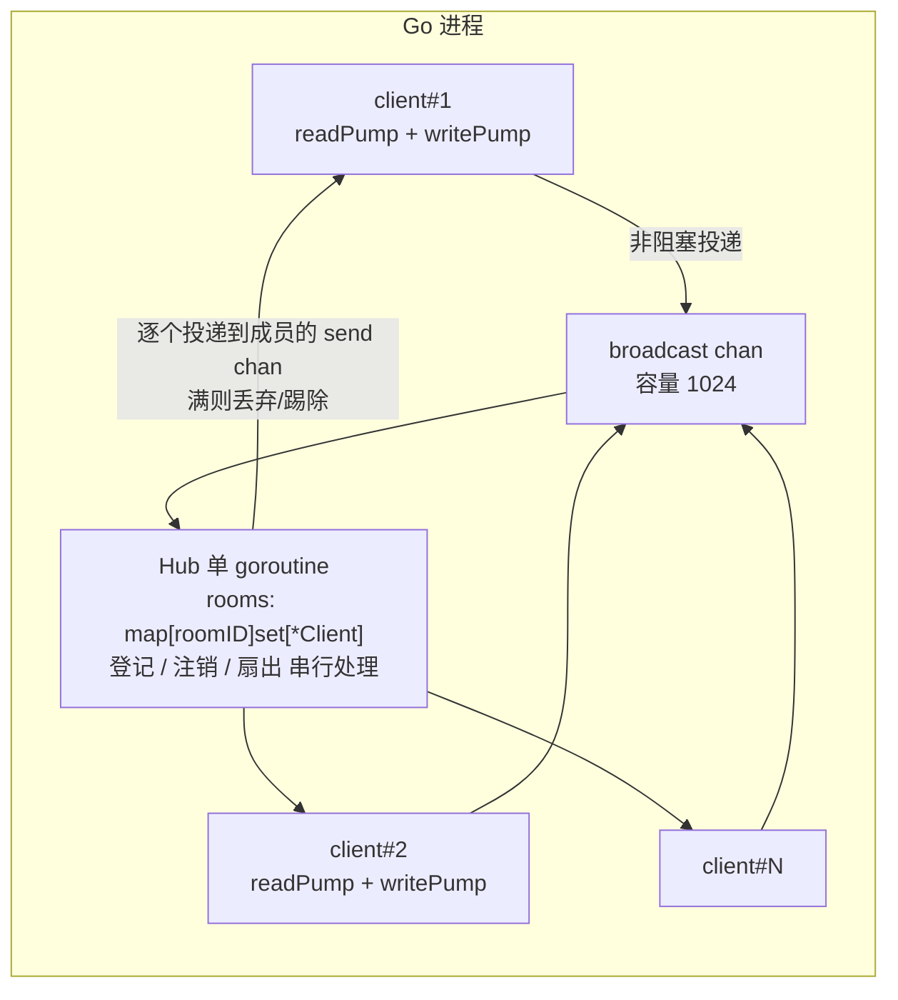
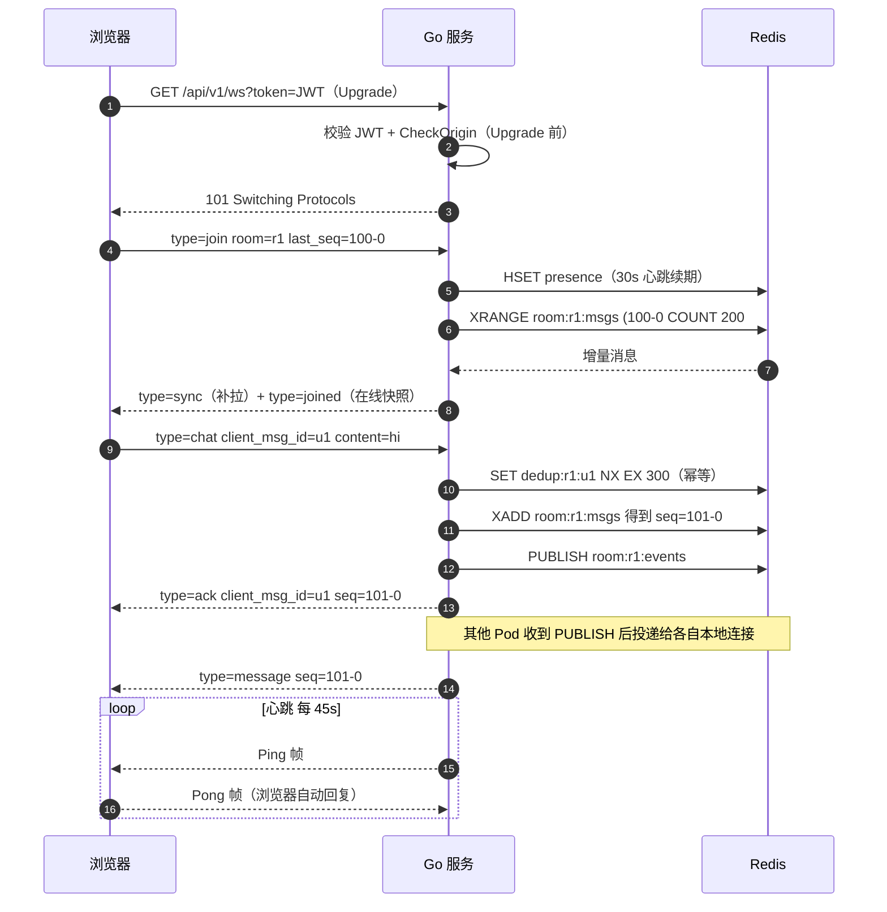
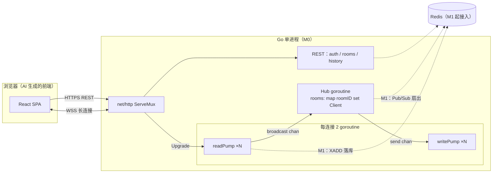
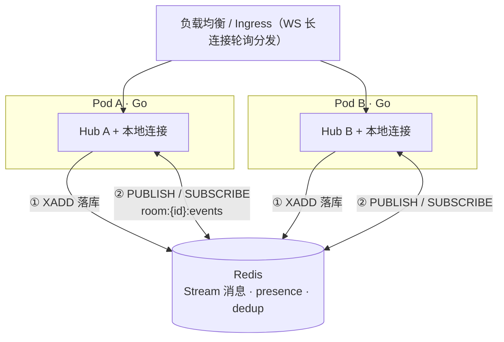
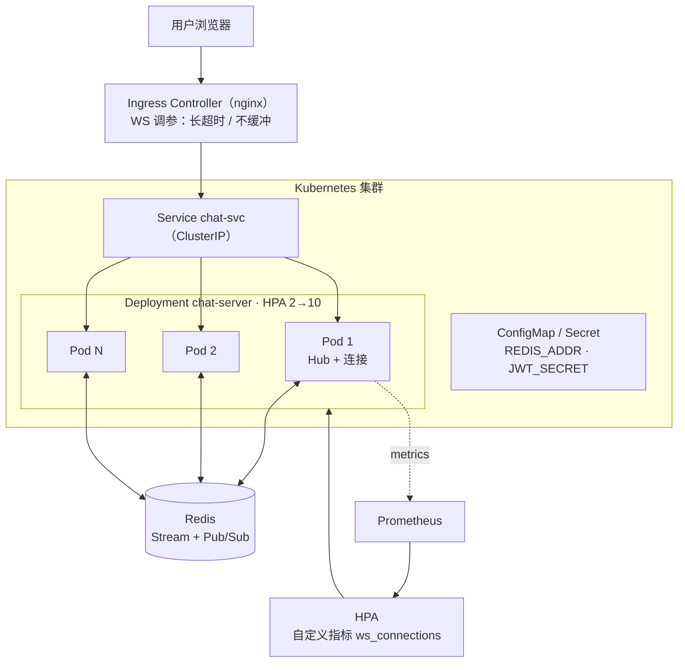
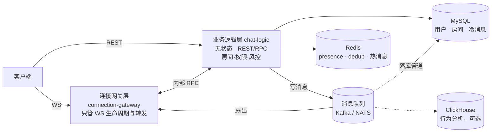

# Go 聊天室开发笔记 —— WebSocket · 高并发 · Redis · K8s 演进全路线

> **适用读者**：Go 有一定基础、不熟 WebSocket 与高并发套路、不写前端（前端交给 AI），并计划未来把服务搬进 K8s 的后端开发者。
>
> **这份笔记包含**：中高级知识地图 → 可抄写的代码骨架 → Redis 存储设计 → 完备接口文档 → 架构图集 → K8s 升级参考 → 前端 AI 生成提示词 → 测试与避坑清单。
>
> **阅读建议**：第一次做请严格按第 0.2 节的 M0→M3 阶段推进，每个阶段都是上一阶段的增量改造。架构图使用 Mermaid 绘制，用 GitHub、Typora 或 VS Code（装 Markdown Preview Mermaid Support 插件）查看即可渲染。

**版本约定**：Go ≥ 1.22（使用标准库增强路由）；`github.com/gorilla/websocket` ≥ v1.5.3；`github.com/redis/go-redis/v9`。

---

## 目录

- ((20261002004301-b568cbq "0. 全景与路线图"))
- ((20261002004301-91l6lo8 "1. WebSocket 核心知识"))
- ((20261002004301-o393a3a "2. 高并发编程套路"))
- ((20261002004301-0tupb8v "3. 核心代码骨架"))
- ((20261002004301-kux4cxs "4. Redis 存储设计"))
- ((20261002004301-zkbq1q1 "5. 接口文档"))
- ((20261002004301-qeq3zcz "6. 架构图"))
- ((20261002004301-nzunm7n "7. K8s 升级参考"))
- ((20261002004301-hncrrpy "8. 前端 AI 生成提示词"))
- ((20261002004301-t79c98r "9. 测试与压测"))
- ((20261002004301-b7zn9wg "10. 常见坑清单"))
- ((20261002004301-picid4m "11. 学习资源"))

---

## 0. 全景与路线图

### 0.1 聊天室到底难在哪

| # | 难点 | 一句话解释                                                                                            | 对应章节  |
| --- | ------ | ------------------------------------------------------------------------------------------------------- | ----------- |
| 1 | **连接即状态**     | HTTP 一问一答无状态；WS 连接活几分钟到几天，进程里挂着海量长生命周期 goroutine，任何重启 = 所有人掉线 | 2.6 / 7.4 |
| 2 | **广播放大**     | 一条消息 = 房间内 N 次网络写，刷屏时写放大、GC 压力、慢消费者全部被放大 N 倍                          | 2.3 / 2.4 |
| 3 | **背压与公平**     | 客户端网络差时队列排多久？满了丢谁踢谁？HTTP 服务不存在的问题，长连接服务天天面对                     | 2.3       |
| 4 | **部署有状态**     | K8s 默认假设 Pod 可随时杀、随意扩缩，但 WS 连接绑定在特定 Pod 上                                      | 7.1–7.5  |

### 0.2 阶段路线（强烈建议按此顺序实现）

| 阶段 | 目标                                | 关键技术                                              | 验收标准                                       |
| ------ | ------------------------------------- | ------------------------------------------------------- | ------------------------------------------------ |
| **M0 单机跑通**     | 多人能聊、断线不崩                  | gorilla/websocket、Hub 模式、心跳、优雅关停           | 单二进制 + 无 Redis，多人聊天正常              |
| **M1 数据不丢可多开**     | 历史可查、重启可恢复、能起 2 个进程 | Redis Stream 历史、presence、Pub/Sub 扇出、seq + 去重 | 杀掉进程重启，客户端重连后补拉到断线期间的消息 |
| **M2 上 K8s**     | 弹性伸缩、滚动更新不掉线            | 探针、连接排水、Ingress 调参、HPA                     | `kubectl rollout` 期间在线用户几乎无感                          |
| **M3 规模化**     | 万级连接、消息可检索                | MQ 替代 Pub/Sub、冷数据落库、网关/逻辑分层            | 见 7.7 终局架构                                |

> M0 的代码骨架在 M1/M2 中约 90% 会被保留，所以第 3 章的骨架值得一开始就写对。

### 0.3 技术选型总表

| 领域         | 选择              | 理由 / 备注                                                   |
| -------------- | ------------------- | --------------------------------------------------------------- |
| 语言         | Go 1.22+          | 标准库 `net/http` 支持 `GET /api/{id}` 通配路由与 `r.PathValue("id")`，少引一个框架                       |
| WebSocket    | gorilla/websocket | 事实标准、资料最多；现代备选 `coder/websocket`（原 nhooyr，全程 context 风格） |
| 路由         | 标准库 `ServeMux`           | M0/M1 足够；需要中间件生态可换 `go-chi/chi`                               |
| Redis 客户端 | go-redis v9 `UniversalClient`      | 单机/哨兵/集群一套代码，K8s 演进无需改调用方                  |
| 认证         | JWT（`golang-jwt/jwt/v5`）           | 无状态鉴权，天然适配多副本与 K8s                              |
| 日志         | `log/slog`                  | 标准库、结构化，K8s 下直接输出 JSON 到 stdout                 |
| 指标         | `prometheus/client_golang`                  | K8s 生态标配，HPA 自定义指标依赖它（7.5）                     |
| 消息编码     | JSON 起步         | 单条消息 > 数万 QPS 再换 protobuf / sonic（2.8）              |
| 前端         | 不写代码，AI 生成 | 第 8 章提示词 + `go:embed` 打包进二进制（8.4）                          |

### 0.4 目标目录结构

```text
chatroom/
├── cmd/server/main.go        # 装配：config → redis → hub → mux → server → 优雅关停
├── internal/
│   ├── api/                  # REST handler + JWT 中间件 + 限流
│   ├── authn/                # JWT 签发/校验
│   ├── chat/                 # Hub、Client、pump、协议（纯内存，不碰网络存储）
│   ├── room/                 # 房间业务（元数据存 Redis）
│   └── store/                # Redis 封装：历史、presence、去重、扇出
├── deploy/
│   ├── Dockerfile
│   └── k8s/                  # deployment / service / ingress / hpa / pdb.yaml
├── web/                      # AI 生成的前端（第 8 章），构建产物 go:embed 进二进制
└── openapi.md                # 第 5 章接口文档
```

**分层原则**：`chat` 包（并发核心）不 import `store`（Redis 封装），由 main 层把二者用接口拼起来——这样并发逻辑可以脱离 Redis 做单测，M3 换 MQ 时也只动装配层。

---

## 1. WebSocket 核心知识

### 1.1 协议本质：一次 HTTP 升级

WebSocket 握手就是一个携带特殊头的 HTTP GET（RFC 6455）：

```http
GET /api/v1/ws?token=xxx HTTP/1.1
Host: chat.example.com
Upgrade: websocket
Connection: Upgrade
Sec-WebSocket-Key: dGhlIHNhbXBsZSBub25jZQ==
Sec-WebSocket-Version: 13
```

```http
HTTP/1.1 101 Switching Protocols
Upgrade: websocket
Connection: Upgrade
Sec-WebSocket-Accept: s3pPLMBiTxaQ9kYGzzhZRbK+xOo=
```

之后这条 TCP 连接不再走"请求-响应"，而是双方随时互发**帧（frame）** 。你需要认识的帧只有 4 种：**Text**（本笔记的 JSON 消息）、**Binary**、**Ping/Pong**（心跳）、**Close**。

三个高频推论（排障必背）：

1. WS 建立在 **HTTP/1.1 Upgrade 机制**上。若网关把该路径协商成了 HTTP/2，Upgrade 不生效，表现为"永远连不上"。
2. 中间所有反向代理/网关必须**透传 Upgrade 头且不缓冲**，否则表现为"连上但消息延迟到达"或"30 秒后必断"。
3. 大部分"莫名断线"是某段网络设备对空闲 TCP 连接设了超时（常见 60s）——**心跳就是为它准备的**（1.5）。

### 1.2 Go 库选型

| 库                         | 风格                         | 适合                      | 结论                           |
| ---------------------------- | ------------------------------ | --------------------------- | -------------------------------- |
| `gorilla/websocket`                           | 显式 deadline + 回调 handler | 教材/生产都最常见         | **本笔记主用**，遇到问题搜得到答案           |
| `coder/websocket`（原 nhooyr.io/websocket） | 全程 `context.Context`                        | 新项目、喜欢 ctx 贯穿一切 | API 更现代，但并发套路完全一致 |

两个库学一个即可，**并发模型、心跳思路、Hub 模式全部通用**。

### 1.3 Upgrader 与 CheckOrigin（安全第一课）

```go
var upgrader = websocket.Upgrader{
    ReadBufferSize:  1024,
    WriteBufferSize: 1024,
    // 浏览器跨域建连时会带 Origin 头。不校验 = 跨站 WebSocket 劫持（CSWSH）：
    // 恶意网页可以让受害者浏览器带着凭证连你的 WS。
    CheckOrigin: func(r *http.Request) bool {
        o := r.Header.Get("Origin")
        if o == "" { // 非浏览器客户端（压测工具、App）没有 Origin
            return true
        }
        return slices.Contains(cfg.AllowedOrigins, o) // 例如 http://localhost:5173
    },
}
```

要点：

- **先鉴权，再 Upgrade**。Upgrade 成功后连接已建立，此时再拒绝只能"建了又断"；Upgrade 前返回 401，浏览器直接报错，语义干净、日志友好。
- `ReadBufferSize/WriteBufferSize` 决定每连接的内存下限，默认 4096 字节。万人在线自己算账：1 万连接 × (读 1KB + 写 1KB + 对象开销 ≈ 10KB) ≈ 数百 MB。

### 1.4 第一铁律：一读一写

gorilla/websocket 明确约定：**同一条连接，同一时刻最多 1 个 goroutine 在读、最多 1 个 goroutine 在写**。并发调用 `WriteMessage` 会损坏帧结构甚至 panic。
（唯一例外：`WriteControl`——发 Ping/Close 用的——文档允许与其他写并发。）

由此推导出聊天室的标准并发结构：**每连接固定 2 个 goroutine**。

```text
            ┌────────────────── 每连接 ──────────────────┐
conn ──读──▶ readPump ──投递──▶ Hub ──广播──▶ send chan ──▶ writePump ──写──▶ conn
```

- **readPump**：阻塞读。负责读超时、处理 pong 续命、解析消息、投递给 Hub。
- **writePump**：独占写权。从自己的 `send` channel 取消息写出，顺带定时发 Ping。
- 其他任何 goroutine（Hub、REST handler）**都不直接碰 conn**，只往 `client.send` 投递。

这条铁律是后续一切设计（Hub、背压、关停）的出发点。

### 1.5 心跳三件套：writeWait / pongWait / pingPeriod

```go
const (
    writeWait  = 10 * time.Second  // 单次写操作的超时
    pongWait   = 60 * time.Second  // 多久没收到对端任何数据就判死
    pingPeriod = pongWait * 9 / 10 // 发 Ping 周期，必须略短于 pongWait
    maxMsgSize = 8 << 10           // 单帧读上限 8KB，防恶意大帧打爆内存
)

func (c *Client) readPump() {
    defer c.close()
    c.conn.SetReadLimit(maxMsgSize)
    _ = c.conn.SetReadDeadline(time.Now().Add(pongWait))
    // 收到 Pong 帧就给读超时"续命"——这就是连接保活的全部逻辑
    c.conn.SetPongHandler(func(string) error {
        return c.conn.SetReadDeadline(time.Now().Add(pongWait))
    })
    for {
        _, data, err := c.conn.ReadMessage()
        if err != nil {
            return // 超时 / 对端关闭 / 网络错误，都从这里退出
        }
        // ... 处理业务消息
    }
}
```

writePump 侧配合定时发 Ping（完整代码见 3.3）。

**浏览器端重要事实**：浏览器 WebSocket API 会**自动回 Pong 帧**，前端 JS 既不需要、也没有 API 去手动回 Pong。所以前端只需要处理"断线重连"，不需要写任何心跳代码（第 8 章提示词里已强调）。

参数经验值：内网/可调环境 pongWait 60s；公网移动端可放宽到 90–120s（省电省流量），但所有空闲超时的网络设备都要小于该值才不会误杀。

### 1.6 关闭：好聚好散与异常断线

- **主动关闭**：先 `WriteControl(websocket.CloseMessage, websocket.FormatCloseMessage(code, text), deadline)` 发 Close 帧（对端能拿到关闭码），再 `conn.Close()`。
- **异常断线**（拔网线、进程被 kill、NAT 超时）：本地**不会有任何报错**，唯一可靠的检测手段就是 ReadDeadline 超时——这就是心跳存在的根本原因。
- **关闭必须幂等**：用 `sync.Once` 包住 `close(c.send)` 和 `conn.Close()`。两个 pump 都可能在任何时刻触发关闭，不加 Once 必然遇到 `close of closed channel` panic 或重复关闭报错。

### 1.7 WS 鉴权三方案

| 方案                   | 做法                              | 优点                                   | 缺点                               |
| ------------------------ | ----------------------------------- | ---------------------------------------- | ------------------------------------ |
| URL query `?token=`             | Upgrade 前在 handler 里校验       | 实现最简单，前端零成本                 | token 可能进 access log / 代理日志 |
| Sec-WebSocket-Protocol | 前端 `new WebSocket(url, [token])`，服务端校验后回带同一子协议 | 不进 URL                               | 语义滥用；两个入口要约定一致       |
| 连接后首消息 `{type:"auth"}`          | Upgrade 后 5s 内等待 auth 消息    | 最灵活（支持匿名浏览→登录后升级连接） | 多一次往返，要处理超时与状态机     |

**决策**：M0/M1 用 query + 强制 HTTPS（nginx 配置 `log_format` 脱敏该参数）。本笔记接口文档（第 5 章）按 query 方案写，前端提示词与之对齐。

另外记住一个前端事实：**浏览器的** **`new WebSocket()`**  **无法自定义 HTTP 头**，所以"WS 带 Authorization 头"在纯浏览器里做不到——这就是存在上面三种方案的原因。

### 1.8 什么时候不用 WebSocket

| 场景                                       | 更合适的方案                              |
| -------------------------------------------- | ------------------------------------------- |
| 只需要服务端→客户端单向推送（通知、行情） | SSE：一个 HTTP 长响应，浏览器原生自动重连 |
| 数据频率低、可容忍 10s 级延迟              | 长轮询                                    |
| 双向、低延迟、高频交互                     | **WebSocket ✓** （聊天室就是它）                          |

聊天室里"历史消息、房间列表"仍然走普通 REST——WS 只承载实时增量，这是清晰且常见的分工（见第 5 章接口文档）。

---

## 2. 高并发编程套路

### 2.1 进程内并发模型总览（M0）



三条设计原则，背下来：

1. **一切通过 channel**：连接之间从不共享可变数据；rooms 这张"目录表"只被 Hub goroutine 读写 → 结构上不存在数据竞争。
2. **投递永不阻塞**：向 broadcast/send 投递一律 `select + default`。宁可丢消息/踢人，绝不能卡死读连接的 goroutine（否则该用户表现为"再也无法收发且占用资源"）。
3. **三条退出路径都要走得通**：进程关停（SIGTERM）、Hub 关停、单连接断开——各自如何触发、谁等谁，见 2.6 与 3.2。

### 2.2 Hub 模式：登记、注销、广播

Hub 只有一个 `Run()` 循环，select 三个 channel：

| channel | 作用                     | 容量建议 |
| --------- | -------------------------- | ---------- |
| `register`        | 连接加入房间             | 64       |
| `unregister`        | 连接退出/被踢，Hub 统一 `close(c.Send)` | 256      |
| `broadcast`        | 待扇出的消息             | 1024     |

为什么"无锁"反而更好：把所有竞态收敛到一个 goroutine 串行处理，是"多生产者-多消费者-共享目录"场景里**最不容易写错**的模式（gorilla 官方 chat 示例就是这么写的）。`-race` 下跑测试也干干净净。

什么时候升级为"per-room hub"：单个 Hub goroutine 的扇出成为瓶颈时（用 `ws_broadcast_duration_seconds` 直方图观测，见 2.9），按房间拆成多个独立 Hub+channel，广播天然互相隔离。**先写单 Hub，压测说话，不要过早优化。**

### 2.3 背压：慢消费者三振出局

send channel 容量有限（256）。扇出时非阻塞投递：

```go
select {
case c.Send <- payload:
    c.drops.Store(0) // 投递成功，清零计数
default:
    if c.drops.Add(1) >= 3 { // 连续丢 3 条 = 慢消费者
        c.kickSlow() // 投递到 unregister 队列，由 Hub 踢除，绝不阻塞扇出路径
    }
    droppedTotal.Inc()
}
```

为什么"丢弃 + 踢人"而不是"无限扩队列"：消息类应用中**延迟堆积比丢弃更伤**——队列越深，用户看到的越"过去"，而且内存被慢客户端拖爆的是整个进程。丢弃的部分由 2.10 的 seq 补拉机制兜底，用户重连/追帧后照样能看全。

### 2.4 广播成本模型与优化

一条消息在 M 人房间 = **M 次系统级写**。1000 人房间 × 10 条/s = 1 万次写/s。优化清单（按收益排序）：

1. **预序列化**：Hub 收到消息只 marshal **一次**成 `[]byte`，扇出时直接把 `[]byte` 投给所有连接（3.1 的 `Broadcast.Payload`）。绝不在 writePump 里重复 `json.Marshal`——这是新手最常见的 N 倍 CPU 浪费。
2. 按业务平均消息大小调小 `WriteBufferSize`（如 1–2KB），显著省内存。
3. 大房间隔离：per-room hub，避免一个大房间的慢扇出拖累全服。
4. profile 后再考虑 `conn.WritePreparedMessage`（复用帧掩码处理，减少分配）。
5. 万级单房间：合帧（攒 20–50ms 的消息合成一个数组帧再写）、换 protobuf（见 2.8）。

### 2.5 channel vs mutex：一张决策表

| 场景                                              | 推荐                        |
| --------------------------------------------------- | ----------------------------- |
| 事件汇入单点（register / unregister / broadcast） | channel + 单 goroutine 串行 |
| 只读多、偶尔写（房间元数据、功能开关、配置热更）  | `RWMutex`                            |
| 纯计数（连接数、消息数、丢弃数）                  | `atomic.Int64` / `atomic.Int32`                         |
| 需要超时、取消传播、跨层传递                      | `context.Context` + channel                  |
| 相同 key 的重复昂贵请求（缓存击穿）               | `golang.org/x/sync/singleflight`                            |

口诀： **"目录型"状态（谁在哪个房间）用 channel 串行化；"属性型"状态（开关、配置）用锁；数字用 atomic。**

### 2.6 优雅关停：四步顺序不能乱（K8s 必考）

1. 收到 SIGTERM（K8s 删除 Pod 时 kubelet 发的就是它）；
2. **停止接受新连接**：`srv.Shutdown(ctx)`。注意它会**等待所有 handler 返回**，而 WS handler 阻塞在 readPump 里——所以第 3 步必须跟上，否则 Shutdown 永远不返回；
3. **主动关闭存量 WS**：`hub.Close()`——向所有连接发 Close 帧并关 conn → readPump 返回错误退出 → handler 返回 → Shutdown 返回；
4. `hub.Wait()` 等全部 client goroutine 退出。Redis presence 不用刻意清理：value 自带过期时间，进程死了 30–90s 后自然失效（4.3）。

完整代码见 3.4。K8s 侧配合项（preStop、terminationGracePeriodSeconds）见 7.4。

### 2.7 限流与防滥用

| 层     | 工具                                 | 目标                              |
| -------- | -------------------------------------- | ----------------------------------- |
| 连接级 | `golang.org/x/time/rate` 令牌桶（如 10 msg/s，桶深 20）      | 防单用户刷屏；超限回 `error 4003`，连续超限踢 |
| 建连级 | nginx/网关 `limit_req` + 单 IP 并发连接上限     | 防建连洪水——**它比消息速率更容易被打挂**                    |
| 房间级 | 房间消息 QPS 上限                    | 保护 Redis 写入与广播路径         |
| 全局   | `ws_connections` gauge 超过阈值时 Upgrade 前返回 503 | 过载保护，宁可拒新不杀旧          |

### 2.8 运行时与内存调优

- 容器里 `GOMAXPROCS` 默认 = 宿主机核数（不是 Pod 的 CPU limit），导致调度抖动与 GC 叠加：引入 `go.uber.org/automaxprocs`（一行 import）。
- 设 `GOMEMLIMIT`（如 512MiB，略低于 Pod memory limit）给 GC 软上限，防止连接堆积导致 OOMKill。
- 广播路径用 `sync.Pool` 复用 `[]byte`；JSON 热点（>5 万 msg/s）换 `bytedance/sonic` 或 protobuf。
- 先 `go tool pprof` 看分配大头，再动手。GOGC/GOMEMLIMIT 盲调是浪费生命。

### 2.9 可观测性（上线第一天就要有）

- `net/http/pprof` 挂**内网**端口：`/debug/pprof/goroutine` 是排查泄漏的第一现场。健康状态下 goroutine 数 ≈ 2×连接数 + 常数，持续增长即泄漏。
- Prometheus 指标最小集：

| 指标 | 类型                                       | 用途                              |
| ------ | -------------------------------------------- | ----------------------------------- |
| `ws_connections`     | gauge                                      | 当前连接数；HPA 自定义指标（7.5） |
| `ws_messages_sent_total` / `ws_messages_received_total`  | counter                                    | 流量画像                          |
| `ws_broadcast_dropped_total`     | counter                                    | 背压丢弃，>0 就该扩容或查慢消费者 |
| `ws_broadcast_duration_seconds`     | histogram                                  | 扇出耗时，决定是否拆 per-room hub |
| `ws_read_errors_total`     | counter（按类型：timeout/close/bad_frame） | 区分正常断线与异常                |

- CI/单测里用 `go.uber.org/goleak` 抓 goroutine 泄漏（9.1）。

### 2.10 消息可靠性模型（本笔记最高级的一招）

目标：**不重、不丢（可补偿）、房间内有序**。

- **有序**：房间内 seq 单调递增。**不要"INCR 再 XADD"两步走**——两步非原子，多副本下 seq 与存储顺序可能错位。**直接用 Redis Stream 自动生成的 ID 当 seq**（形如 `1730000000000-0`），天然单调、与存储强一致，分页与补拉都按它来。
- **不重**：客户端为每条消息生成 `client_msg_id`（UUID），服务端 `SET dedup:{room}:{client_msg_id} 1 NX EX 300`；设置失败 = 重复消息，直接返回原 seq 的 ack（幂等）。
- **不丢**：服务端写 Stream 成功即"已接收"（权威记录）；广播走 Pub/Sub 是**尽力而为**；掉线客户端重连后带 `last_seq`，服务端 `XRANGE (last_seq` 补拉增量——同时兜住了"断线漏收"和"背压丢弃"两种情况。
- **ACK**：服务端对每条 chat 回 `{type:"ack", client_msg_id, seq}`；客户端超时未收到 ack 可重发，重发靠 dedup 幂等，不会产生重复消息。

这套"**Pub/Sub 尽力广播 + Stream 权威记录 + seq 补拉**"是聊天室在 Redis 上的经典组合拳。M3 换 Kafka/NATS 时，把 Stream 换成 topic、补拉换消费者位点即可，**客户端协议完全不用变**。

---

## 3. 核心代码骨架

> 可直接抄写改造。为聚焦主干，错误处理做了精简，生产上补齐日志与指标打点（2.9 的指标点已用注释标出）。

### 3.1 types.go：协议与广播单元

```go
package chat

import (
        "sync"
        "sync/atomic"

        "github.com/gorilla/websocket"
)

const (
        sendBuf      = 256 // send channel 容量：太小易丢，太大延迟堆
        dropKickAt   = 3   // 连续丢弃 3 条判为慢消费者
)

// Broadcast 是预序列化后的广播单元：
// 一条消息 marshal 一次，房间内 N 个连接复用同一个 []byte（见 2.4）。
type Broadcast struct {
        RoomID  string
        From    *Client // 可为 nil（系统消息）
        Payload []byte  // 已 marshal 的 JSON envelope
}

type Client struct {
        Hub    *Hub
        Conn   *websocket.Conn
        Send   chan []byte // 只能由 Hub close（唯一所有者）
        UserID string
        Name   string
        RoomID string // M0 简化：一次一个房间；多房间改成 map[string]struct{}

        done      chan struct{}
        closeOnce sync.Once   // 关闭必须幂等（1.6）
        drops     atomic.Int32
}

func newClient(h *Hub, conn *websocket.Conn, userID, name, roomID string) *Client {
        return &Client{
                Hub: h, Conn: conn,
                Send:   make(chan []byte, sendBuf),
                UserID: userID, Name: name, RoomID: roomID,
                done: make(chan struct{}),
        }
}

// close 幂等关闭：两个 pump 都可能率先触发。
func (c *Client) close() {
        c.closeOnce.Do(func() {
                close(c.done)
                _ = c.Conn.Close()
        })
}

// kickSlow 把踢人决定交给 Hub，扇出路径绝不阻塞（2.3）。
func (c *Client) kickSlow() {
        select {
        case c.Hub.unregister <- c:
        default: // 队列忙就下次再说，drops 继续累计
        }
}
```

### 3.2 hub.go：并发核心（无锁的秘密）

```go
package chat

import (
        "context"
        "time"
)

type Hub struct {
        ctx        context.Context
        cancel     context.CancelFunc
        register   chan *Client
        unregister chan *Client
        broadcast  chan *Broadcast

        rooms map[string]map[*Client]struct{} // 只在 Run goroutine 内访问 → 零锁
        wg    sync.WaitGroup                  // 等待 Run 退出
        clients sync.WaitGroup                // 等待所有 client goroutine 退出
}

func NewHub() *Hub {
        ctx, cancel := context.WithCancel(context.Background())
        return &Hub{
                ctx: ctx, cancel: cancel,
                register:   make(chan *Client, 64),
                unregister: make(chan *Client, 256),
                broadcast:  make(chan *Broadcast, 1024),
                rooms:      make(map[string]map[*Client]struct{}),
        }
}

// Run 是唯一触碰 rooms 的 goroutine（2.2）。
func (h *Hub) Run() {
        h.wg.Add(1)
        defer h.wg.Done()
        for {
                select {
                case <-h.ctx.Done():
                        return
                case c := <-h.register:
                        set := h.rooms[c.RoomID]
                        if set == nil {
                                set = make(map[*Client]struct{})
                                h.rooms[c.RoomID] = set
                        }
                        set[c] = struct{}{}
                        h.clients.Add(2) // readPump + writePump
                case c := <-h.unregister:
                        h.remove(c)
                case b := <-h.broadcast:
                        h.fanout(b)
                }
        }
}

func (h *Hub) remove(c *Client) {
        if set := h.rooms[c.RoomID]; set != nil {
                delete(set, c)
                if len(set) == 0 {
                        delete(h.rooms, c.RoomID)
                }
        }
        close(c.Send) // 通知 writePump 退出（读到 !ok）
        c.close()
}

func (h *Hub) fanout(b *Broadcast) {
        start := time.Now()
        defer func() { broadcastDuration.Observe(time.Since(start).Seconds()) }() // 2.9

        for c := range h.rooms[b.RoomID] {
                if c == b.From {
                        continue // 是否回显发言者自己，看产品需求
                }
                select {
                case c.Send <- b.Payload:
                        c.drops.Store(0)
                default:
                        if c.drops.Add(1) >= dropKickAt {
                                c.kickSlow()
                        }
                        droppedTotal.Inc() // 2.9
                }
        }
}

// Join 由 /ws handler 调用：投递注册事件（非阻塞）。
func (h *Hub) Join(c *Client) {
        select {
        case h.register <- c:
        default:
                c.close() // 系统过载：直接拒绝新连接
        }
}

func (h *Hub) Publish(roomID string, from *Client, payload []byte) {
        select {
        case h.broadcast <- &Broadcast{RoomID: roomID, From: from, Payload: payload}:
        default:
                droppedTotal.Inc() // 全局广播队列满：丢弃并计数，让客户端靠补拉找回
        }
}

// Close 优雅关停（2.6 第 3 步）：停循环 → 等 Run 退出 → 冻结 rooms → 逐个关连接。
func (h *Hub) Close() {
        h.cancel()
        h.wg.Wait() // Run 已退出，rooms 不再变化，此后遍历是安全的
        for _, set := range h.rooms {
                for c := range set {
                        c.close() // 关 conn → 对端 readPump 报错退出 → handler 返回 → Shutdown 返回
                }
        }
}

func (h *Hub) Wait() { h.clients.Wait() }
```

> 注意 `close(c.Send)` 只出现在 `Hub.remove` 里——**channel 的 close 权归唯一所有者**，这是避免 "send on closed channel" panic 的纪律。

### 3.3 client.go：双 pump 模板

```go
package chat

import (
        "encoding/json"
        "time"

        "github.com/gorilla/websocket"
        "golang.org/x/time/rate"
)

const (
        writeWait  = 10 * time.Second
        pongWait   = 60 * time.Second
        pingPeriod = pongWait * 9 / 10
        maxMsgSize = 8 << 10
)

var limiter = rate.NewLimiter(10, 20) // 每连接 10 msg/s，桶深 20（2.7）

// ---------- 读循环 ----------

func (c *Client) readPump() {
        defer func() {
                select {
                case c.Hub.unregister <- c: // 交还 Hub 统一摘除
                default:
                        c.close() // Hub 已停（关停中），自己兜底关闭
                }
        }()

        c.Conn.SetReadLimit(maxMsgSize)
        _ = c.Conn.SetReadDeadline(time.Now().Add(pongWait))
        c.Conn.SetPongHandler(func(string) error {
                return c.Conn.SetReadDeadline(time.Now().Add(pongWait)) // 1.5 续命
        })

        for {
                _, data, err := c.Conn.ReadMessage()
                if err != nil {
                        return
                }
                if !limiter.Allow() {
                        c.sendError(4003, "rate limited")
                        continue
                }
                var in InEnvelope
                if err := json.Unmarshal(data, &in); err != nil {
                        c.sendError(4400, "bad json")
                        continue
                }
                switch in.Type {
                case "chat":
                        c.handleChat(in) // M1 中这里先写 Redis Stream 拿 seq，再广播
                case "typing":
                        c.Hub.Publish(c.RoomID, c, mustJSON(OutEnvelope{
                                Type: "typing", Room: c.RoomID,
                                From: &User{ID: c.UserID, Name: c.Name},
                        }))
                case "ping":
                        c.trySend(mustJSON(OutEnvelope{Type: "pong"}))
                default:
                        c.sendError(4400, "unknown type")
                }
        }
}

// ---------- 写循环 ----------

func (c *Client) writePump() {
        ticker := time.NewTicker(pingPeriod)
        defer ticker.Stop()
        for {
                select {
                case msg, ok := <-c.Send:
                        _ = c.Conn.SetWriteDeadline(time.Now().Add(writeWait))
                        if !ok { // Hub 关闭了 send：礼节性发 Close 帧后退出
                                _ = c.Conn.WriteMessage(websocket.CloseMessage,
                                        websocket.FormatCloseMessage(websocket.CloseNormalClosure, ""))
                                return
                        }
                        if err := c.Conn.WriteMessage(websocket.TextMessage, msg); err != nil {
                                return
                        }
                case <-ticker.C: // 心跳：浏览器会自动回 Pong（1.5）
                        _ = c.Conn.SetWriteDeadline(time.Now().Add(writeWait))
                        if err := c.Conn.WriteMessage(websocket.PingMessage, nil); err != nil {
                                return
                        }
                case <-c.done: // 连接已被任何一方关闭
                        return
                }
        }
}

// ---------- 辅助 ----------

func (c *Client) trySend(payload []byte) {
        select {
        case c.Send <- payload:
        default:
                droppedTotal.Inc()
        }
}

func (c *Client) sendError(code int, msg string) {
        c.trySend(mustJSON(OutEnvelope{Type: "error", Code: code, Message: msg}))
}

func mustJSON(v any) []byte {
        b, _ := json.Marshal(v)
        return b
}
```

### 3.4 main.go：装配 + 优雅关停

```go
package main

import (
        "context"
        "errors"
        "log/slog"
        "net/http"
        "os"
        "os/signal"
        "sync/atomic"
        "syscall"
        "time"

        "github.com/redis/go-redis/v9"
        "go.uber.org/automaxprocs/maxprocs" // 容器内修正 GOMAXPROCS（2.8）

        "chatroom/internal/api"
        "chatroom/internal/chat"
)

var ready atomic.Int32 // readiness 开关

func main() {
        _, _ = maxprocs.Set() // 2.8
        logger := slog.New(slog.NewJSONHandler(os.Stdout, nil))

        rdb := redis.NewClient(&redis.Options{Addr: env("REDIS_ADDR", "localhost:6379")})
        hub := chat.NewHub()
        go hub.Run()

        mux := http.NewServeMux()
        mux.HandleFunc("GET /api/v1/ws", api.WSHandler(hub, logger)) // 3.5
        mux.HandleFunc("GET /healthz", func(w http.ResponseWriter, _ *http.Request) {
                w.WriteHeader(http.StatusOK) // liveness 不查依赖（7.3）！
        })
        mux.HandleFunc("GET /readyz", func(w http.ResponseWriter, _ *http.Request) {
                if ready.Load() == 0 {
                        http.Error(w, "draining", http.StatusServiceUnavailable)
                        return
                }
                ctx, cancel := context.WithTimeout(context.Background(), 500*time.Millisecond)
                defer cancel()
                if err := rdb.Ping(ctx).Err(); err != nil {
                        http.Error(w, "redis down", http.StatusServiceUnavailable)
                        return
                }
                w.WriteHeader(http.StatusOK)
        })

        srv := &http.Server{Addr: ":8080", Handler: mux, ReadHeaderTimeout: 5 * time.Second}
        go func() {
                if err := srv.ListenAndServe(); err != nil && !errors.Is(err, http.ErrServerClosed) {
                        logger.Error("server crashed", "err", err)
                        os.Exit(1)
                }
        }()
        ready.Store(1)
        logger.Info("listening", "addr", ":8080")

        ctx, stop := signal.NotifyContext(context.Background(), syscall.SIGINT, syscall.SIGTERM)
        defer stop()
        <-ctx.Done()
        logger.Info("shutting down")

        // 1) 摘流：readyz 返回 503 → K8s Service 摘除本 Pod（7.3/7.4）
        ready.Store(0)
        // 2) 等负载均衡传播（等价于 preStop sleep，且不依赖镜像里有 shell）
        time.Sleep(8 * time.Second)
        // 3) 停止接受新连接。Shutdown 会等 WS handler 返回，
        //    而 handler 的返回依赖第 4 步，所以先放 goroutine。
        shCtx, cancel := context.WithTimeout(context.Background(), 30*time.Second)
        defer cancel()
        go func() { _ = srv.Shutdown(shCtx) }()
        // 4) 主动关闭存量 WS：Close 帧 → conn close → readPump 退出 → handler 返回
        hub.Close()
        hub.Wait()
        logger.Info("bye")
}
```

### 3.5 WS 入口 handler（先鉴权，再 Upgrade）

```go
package api

var upgrader = websocket.Upgrader{
        ReadBufferSize:  1024,
        WriteBufferSize: 1024,
        CheckOrigin: func(r *http.Request) bool {
                o := r.Header.Get("Origin")
                return o == "" || slices.Contains(cfg.AllowedOrigins, o) // 1.3
        },
}

func WSHandler(h *chat.Hub, logger *slog.Logger) http.HandlerFunc {
        return func(w http.ResponseWriter, r *http.Request) {
                // 1) Upgrade 前鉴权（1.3）
                claims, err := authn.Verify(r.URL.Query().Get("token"))
                if err != nil {
                        http.Error(w, "unauthorized", http.StatusUnauthorized)
                        return
                }
                // 2) Upgrade + 建 Client + 注册
                conn, err := upgrader.Upgrade(w, r, nil)
                if err != nil {
                        return // Upgrade 失败时 gorilla 已写过响应
                }
                c := chat.NewClient(h, conn, claims.UserID, claims.Name, defaultRoom)
                h.Join(c)
                go c.writePump() // 顺序：先起写泵，再起读泵（读泵 defer 会触发注销）
                go c.readPump()
                logger.Info("client joined", "uid", c.UserID, "room", c.RoomID)
        }
}
```

---

## 4. Redis 存储设计

> 目标：进程重启消息不丢、多副本可部署、内存可控。M0 之前不碰 Redis，M1 一次性接入以下设计。

### 4.1 数据结构总表

| 数据                 | 结构         | Key（带前缀示例） | TTL / 裁剪                              |
| ---------------------- | -------------- | ------------------- | ----------------------------------------- |
| 房间消息（权威记录） | **Stream**             | `chat:prod:room:{id}:msgs`                  | 写路径 `XTRIM MAXLEN ~ 10000`                                 |
| 房间在线成员         | Hash         | `chat:prod:room:{id}:presence`                  | value 内嵌过期时间，读时过滤 + 后台清理 |
| 消息去重             | String SETNX | `chat:prod:dedup:{room}:{client_msg_id}`                  | 300s                                    |
| 房间元数据           | Hash         | `chat:prod:room:{id}:meta`                  | 永久                                    |
| 多节点扇出           | Pub/Sub      | `chat:prod:room:{id}:events`                  | 无（尽力而为，见 4.4）                  |

命名纪律：统一 `chat:{env}:` 前缀，多套环境共用 Redis 不打架；key 里只放小写与冒号，方便 SCAN 按模式巡检。

### 4.2 消息历史：Redis Stream（核心设计）

写（每条聊天消息）：

```text
XADD chat:prod:room:r1:msgs MAXLEN ~ 10000 * uid u1 name Bob body "hello" ts 1730000000
→ "1730000000000-0"        ← 返回值就是这条消息的 seq（2.10：seq 与存储天然强一致）
```

读最近一页（倒序）：

```text
XREVRANGE chat:prod:room:r1:msgs + - COUNT 50
```

重连补拉增量（6.2+ 开区间语法，`(` 表示不含该 ID）：

```text
XRANGE chat:prod:room:r1:msgs (1730000000000-0 COUNT 200
```

go-redis v9 写法：

```go
func (s *Store) Append(ctx context.Context, roomID string, m Message) (string, error) {
        id, err := s.rdb.XAdd(ctx, &redis.XAddArgs{
                Stream: fmt.Sprintf("chat:%s:room:%s:msgs", s.env, roomID),
                MaxLen: 10000, Approx: true, // ~ 近似裁剪：O(1) 写入，略多于 1 万条无妨
                Values: []string{"uid", m.UserID, "name", m.Name, "body", m.Content, "ts", m.TS},
        }).Result()
        return id, err // id 即 seq，随后 PUBLISH 的 payload 里带上它
}
```

**为什么是 Stream 而不是别的**：

| 候选             | 结论                                             |
| ------------------ | -------------------------------------------------- |
| List             | 无范围分页、无消息 ID，补拉没法做                |
| ZSet             | 要手造 score，与时间冗余两套"尺子"               |
| 独立 INCR + Hash | seq 与存储两步写入非原子，多副本下会错位（2.10） |
| **Stream**                 | **天然追加日志 + 消息 ID 单调 + 按 ID 范围查询 + MAXLEN 裁剪，就是为此设计的**                                                 |

消息体用扁平字段而非 JSON 大字符串：字段演进友好、Redis 里可读、部分读不用反序列化。

### 4.3 在线状态 presence

```text
# 连接建立 + 每 30s 心跳续期（WS ping 或应用层 ping 都可触发）
HSET chat:prod:room:r1:presence u1 "podA:1730000060"   # 值 = 节点ID:过期时间戳

# 读在线成员：HGETALL 后过滤掉 过期时间 < now 的条目（惰性过期）
HGETALL chat:prod:room:r1:presence

# 正常退出
HDEL chat:prod:room:r1:presence u1
```

设计要点：

- **惰性过期**：读到已过期的条目直接视为离线；另起后台协程每 60s `HSCAN` 清理一次脏数据。
- **进程被 kill -9 也不怕**：条目 30–90s 内自然过期，不需要清理逻辑。
- **值里带 nodeID**：排查"这个连接挂在哪个 Pod"，也是将来做定向踢人/定向推送的基础。
- 变化时向房间 `PUBLISH` 一条 `presence` 事件，前端在线列表实时更新（5.4）。

### 4.4 多节点扇出：Pub/Sub vs Streams（重要决策）

| 维度     | Pub/Sub                          | Streams + Consumer Group           |
| ---------- | ---------------------------------- | ------------------------------------ |
| 投递语义 | 尽力而为，订阅断开即丢           | 至少一次，可重放                   |
| 延迟     | 极低                             | 略高（消费调度开销）               |
| 复杂度   | 低                               | 高（consumer 管理、ACK、积压监控） |
| 适合     | 聊天室实时广播（有 Stream 兜底） | 计费/订单等"绝对不能丢"的管道      |

**结论：实时广播用 Pub/Sub，权威记录用 Stream，两者配合构成 2.10 的可靠性模型。**  丢广播不可怕，因为：消息已在 Stream 里，任何客户端都能按 seq 补回。

订阅循环骨架（每个 Pod 一个）：

```go
func RunFanout(ctx context.Context, rdb redis.UniversalClient, hub *chat.Hub) {
        pubsub := rdb.Subscribe(ctx) // 起始为空，按需动态订阅
        go func() {
                for msg := range pubsub.Channel() {
                        // msg.Channel = "chat:prod:room:r1:events"
                        // payload = 已序列化的 envelope（XADD 时同时 PUBLISH 的同一条）
                        room := roomFromChannel(msg.Channel)
                        hub.Publish(room, nil, []byte(msg.Payload))
                }
        }()
        // 房间第一个本地成员加入时： pubsub.Subscribe(ctx, ch)
        // 最后一个本地成员离开时： pubsub.Unsubscribe(ctx, ch)
        // （多房间热圈：直接常驻订阅 PSUBSCRIBE chat:*:events 也行，简单但收全量流量）
}
```

写路径组合拳（`handleChat`，M1 版）：

```text
1. SET dedup NX EX 300        → 已存在则直接回 ack(旧 seq)，结束（幂等）
2. XADD msgs MAXLEN ~ 10000   → 得到 seq（权威记录）
3. PUBLISH room:{id}:events   → 本地 + 远端 Pod 的 Hub 实时扇出（尽力而为）
4. 回 ack(client_msg_id, seq) → 发言者确认
```

### 4.5 内存治理与容量估算

- 估算：1 万条 × 平均 300B × 活跃房间 1000 ≈ 3GB。按活跃房间数与留存策略调 `MAXLEN`。
- `maxmemory-policy` 用 **`noeviction`**  **+ 内存告警**：聊天历史被 LRU 驱逐 = 静默丢数据，不能接受。要限制就收紧 MAXLEN，不要靠驱逐。
- 持久化：**AOF everysec**（最多丢 1 秒，可接受；重启不丢历史），RDB 做冷备。
- 冷房间兜底：定时任务对长期无消息房间执行 `XTRIM`。
- 客户端用 `UniversalClient`：未来从单机切哨兵/集群，业务代码零改动。

### 4.6 M3 预告：冷数据落库

Stream 只保热数据（最近 1 万条）。用 Streams Consumer Group（或 M3 的 MQ）做"落库管道"，把消息异步双写进 MySQL（按用户/房间检索）或 ClickHouse（行为分析）。**写路径永远只同步碰 Redis，落库是旁路**——这是聊天服务延迟稳定的常识。

---

## 5. 接口文档

> 本节即 `openapi.md` 的内容，可直接交给前端（第 8 章提示词已内嵌精简版）与压测脚本使用。

### 5.1 通用约定

| 项       | 约定                                                    |
| ---------- | --------------------------------------------------------- |
| Base URL | `https://chat.example.com/api/v1`                                                        |
| 认证     | `Authorization: Bearer <jwt>`；WS 走 `?token=`（1.7）                                         |
| 时间戳   | Unix 秒，int64；WS envelope 另有毫秒级 Stream ID 作 seq |
| 错误响应 | 统一 body：`{"code": "<机器可读snake_case>", "message": "<人类可读>"}`                                             |
| 幂等     | 发消息靠 `client_msg_id` 幂等；重试安全                                |
| 分页     | 消息用 seq 游标（`before_seq` / `last_seq`），不用页码                        |

**HTTP 错误码**：

| HTTP | code | 场景                   |
| ------ | ------ | ------------------------ |
| 400  | `bad_request`     | 参数缺失/格式错误      |
| 401  | `unauthorized`     | token 缺失/过期        |
| 403  | `forbidden`     | 无权限（非房间成员等） |
| 404  | `room_not_found` / `user_not_found`  | 资源不存在             |
| 429  | `rate_limited`     | 触发限流，带 `Retry-After` 头       |
| 500  | `internal`     | 服务端错误             |

### 5.2 REST 端点一览

| Method | Path | 认证 | 说明                         |
| -------- | ------ | ------ | ------------------------------ |
| POST   | `/auth/register`     | ✗   | 注册                         |
| POST   | `/auth/login`     | ✗   | 登录，换 JWT                 |
| GET    | `/users/me`     | ✓   | 当前用户                     |
| GET    | `/rooms`     | ✓   | 房间列表（游标分页）         |
| POST   | `/rooms`     | ✓   | 创建房间                     |
| GET    | `/rooms/{id}`     | ✓   | 房间详情                     |
| GET    | `/rooms/{id}/members`     | ✓   | 在线成员（来自 presence）    |
| GET    | `/rooms/{id}/messages`     | ✓   | 历史消息（seq 游标倒序分页） |
| GET    | `/healthz`     | ✗   | 存活探针（不查依赖，7.3）    |
| GET    | `/readyz`     | ✗   | 就绪探针（查 Redis）         |
| GET    | `/metrics`     | 内网 | Prometheus 抓取              |
| GET    | `/debug/pprof/*`     | 内网 | pprof                        |

### 5.3 核心接口详情

**POST /auth/register**

```json
// 请求
{"username": "bob", "password": "S3cret!pass"}
// 201
{"user_id": "u_01HXYZ...", "created_at": 1730000000}
// 400
{"code": "bad_request", "message": "username taken"}
```

**POST /auth/login**

```json
// 请求
{"username": "bob", "password": "S3cret!pass"}
// 200
{
  "token": "eyJhbGciOi...",          // JWT，默认 24h
  "expires_at": 1730086400,
  "user": {"id": "u_01HXYZ...", "name": "bob"}
}
```

**GET /rooms**

```json
// 200（游标分页：响应里的 next_cursor 原样回传作 query 参数）
{
  "rooms": [
    {"id": "r1", "name": "大客厅", "member_count": 42}
  ],
  "next_cursor": "r1"
}
```

**POST /rooms**

```json
// 请求
{"name": "新房间"}
// 201
{"id": "r2", "name": "新房间", "member_count": 0}
```

**GET /rooms/{id}/messages?limit=50&before_seq=**

```json
// 200。messages 按 seq 倒序（新→旧）；查更早一页时传本页最后一条的 seq 作 before_seq
{
  "messages": [
    {"seq": "1730000000123-0", "from": {"id": "u1", "name": "bob"},
     "content": "hello", "ts": 1730000000},
    {"seq": "1730000000100-0", "from": {"id": "u2", "name": "alice"},
     "content": "hi", "ts": 1730000000}
  ],
  "has_more": true
}
```

**GET /rooms/{id}/members**

```json
// 200（presence 快照，仅在线）
{"members": [{"id": "u1", "name": "bob"}, {"id": "u2", "name": "alice"}]}
```

### 5.4 WebSocket 通道协议

**建连**：`GET /api/v1/ws?token=<jwt>`，Upgrade 成功后全双工。Upgrade 前鉴权失败返回 **HTTP 401**（不是 WS 错误码）。

**Envelope 约定**：一行一个 JSON 文本帧；公共字段 `type` 必填；服务端下行消息带 `seq`（房间内 Stream ID，**字符串**传输——后 63 位是序号，超过 JS Number 安全范围）与 `ts`。

**C→S 消息类型**：

| type | 字段 | 说明                                                       |
| ------ | ------ | ------------------------------------------------------------ |
| `join`     | `room`, `last_seq`   | 订阅房间；`last_seq` 传客户端收到的最大 seq（首次 `""`），服务端据此补拉 |
| `leave`     | `room`     | 退出房间                                                   |
| `chat`     | `room`, `client_msg_id`, `content` | 发言；`client_msg_id` 用 UUID，幂等键                                     |
| `typing`     | `room`     | 正在输入（≤1 次/2s，前端节流）                            |
| `ping`     | —   | 应用层心跳（可选，服务端回 `pong`）                              |

```json
{"type": "chat", "room": "r1", "client_msg_id": "550e8400-e29b-41d4-a716-446655440000", "content": "hello"}
```

**S→C 消息类型**：

| type | 字段     | 说明                                            |
| ------ | ---------- | ------------------------------------------------- |
| `joined`     | `room`, `members[]`       | join 成功，返回当前在线快照                     |
| `sync`     | `room`, `messages[]`, `last_seq`     | 重连/追帧补拉的消息（含 last_seq 之后所有漏收） |
| `message`     | `room`, `seq`, `from{id,name}`, `content`, `ts` | 新消息广播                                      |
| `ack`     | `room`, `client_msg_id`, `seq`, `ts`   | 服务端已落库确认（发言者去重/置灰用）           |
| `presence`     | `room`, `joins[]`, `leaves[]`     | 在线变化（leaves 为 userID 数组）               |
| `typing`     | `room`, `from{id,name}`       | 他人正在输入                                    |
| `error`     | `code`, `message`, `ref`     | `ref` = 触发本错误的 `client_msg_id`                                |
| `pong`     | —       | 应用层心跳应答                                  |

```json
{"type": "message", "room": "r1", "seq": "1730000000123-0",
 "from": {"id": "u1", "name": "bob"}, "content": "hello", "ts": 1730000000}
```

### 5.5 WS 关闭码与 WS error 码

| Close code | 含义                             | 客户端动作           |
| ------------ | ---------------------------------- | ---------------------- |
| 1000       | 正常关闭（服务端维护/重启）      | 自动重连（指数退避） |
| 4001       | 未认证 / token 过期              | **停止重连，回登录页**                     |
| 4002       | 未加入房间就发言                 | 检查 join 流程       |
| 4003       | 触发限流                         | 放慢发送             |
| 4008       | 慢消费者被踢（背压丢弃过多）     | 自动重连 + 补拉      |
| 4400       | 协议错误（JSON 不合法/字段缺失） | 检查消息格式         |
| 4500       | 服务内部错误                     | 自动重连             |

`error` 消息的 code 复用上表数值，`ref` 关联到具体请求。

### 5.6 全链路时序图（建连 → 补拉 → 发言 → 心跳）



---

## 6. 架构图

### 6.1 M0：单机架构



要点：**一个二进制搞定一切**；Hub 与 client 的并发结构见 2.1；Redis 在 M0 阶段可以完全不接。

### 6.2 M1：多副本 + Redis（进程不再有"全局真相"）



要点：

- **内存 Hub 只是"本地连接的目录"** ，不再拥有全局真相；全局真相在 Redis。
- 跨 Pod 可见的顺序以 **Stream ID 为准**，Pub/Sub 只负责"通知得快"，不保证不丢（丢 = 靠补拉，2.10）。
- 同一 Pod 内的消息：XADD 后 PUBLISH 会回到自己（自己也是订阅者），Hub 需按 `from` 去重回显，避免发言者收到两遍。

### 6.3 M2：K8s 目标架构



要点：

- 扩容 = 新 Pod 接**新**连接；存量连接不迁移（迁移 = 全部断开重连，代价更大）。
- 因为有 Redis 扇出，**同一个房间的两个用户可以连在不同 Pod 上照常聊天**——这是能水平扩容的根本前提。
- Ingress 的 WS 关键配置见 7.2；探针与停机见 7.3/7.4。

### 6.4 M3：规模化终局架构（参考）



演进逻辑： **"连接"与"逻辑"分离**——网关保持海量长连接但业务极薄，逻辑层无状态随意扩缩，中间用 MQ 解耦削峰。到这一步，M1 的协议（seq/ack/sync）原样保留，只把"Pub/Sub+Stream"实现替换成 MQ 实现。

---

## 7. K8s 升级参考

### 7.1 心智转变：K8s 会随时杀你的 Pod

Deployment 的默认假设是 Pod 可随时被杀、随意扩缩、滚动更新。对 WS 服务意味着：

| K8s 行为             | 对聊天室的影响               | 应对                                                          |
| ---------------------- | ------------------------------ | --------------------------------------------------------------- |
| 滚动更新逐个重启 Pod | 该 Pod 上所有连接断开        | 客户端自动重连 + seq 补拉（2.10，**协议层已兜底**）；控制断开规模（PDB，7.6） |
| Pod 被缩容/驱逐      | 同上                         | 优雅停机排水（7.4）                                           |
| 节点故障             | 连接瞬间消失                 | 同上；presence 靠 TTL 自愈（4.3）                             |
| HPA 扩容             | 新连接分到新 Pod，老连接不动 | 天然可行，无需迁移                                            |

核心结论：**先把 2.10 的可靠性协议做对，K8s 的一切"粗暴"行为都只是"一次断线重连"** 。

### 7.2 Ingress 对 WS 的关键配置（nginx ingress）

nginx ingress 检测到 `Upgrade` 头会自动支持 WS，但有三个默认值会坑死长连接：

| 问题                       | 默认值         | 配置                                     |
| ---------------------------- | ---------------- | ------------------------------------------ |
| 空闲连接被代理掐断         | `proxy-read-timeout: 60s`               | 调到 3600（心跳 45s 本可续命，但双保险） |
| 发送超时                   | `proxy-send-timeout: 60s`               | 同上                                     |
| 响应被缓冲，消息"攒着"到达 | 开启 buffering | 关闭                                     |

```yaml
metadata:
  annotations:
    nginx.ingress.kubernetes.io/proxy-read-timeout: "3600"
    nginx.ingress.kubernetes.io/proxy-send-timeout: "3600"
    nginx.ingress.kubernetes.io/proxy-buffering: "off"
    # 可选：cookie 会话粘性。有 Redis 扇出后并非必需，
    # 但能把同一用户稳定打到同一 Pod，减少跨节点广播，建议加上
    nginx.ingress.kubernetes.io/affinity: "cookie"
    nginx.ingress.kubernetes.io/session-cookie-name: "CHAT_AFFINITY"
```

> 别忘了检查链路上的其他代理（云 LB、CDN）：任何一个环节 60s 掐空闲连接，用户就每分钟掉线重连一次。

### 7.3 探针设计（一不留神全服自杀）

| 探针      | 端点 | 检查什么                 | 参数 |
| ----------- | ------ | -------------------------- | ------ |
| liveness  | `/healthz`     | **只检查进程活着**，不查 Redis             | `initialDelay 5s, period 10s, failureThreshold 3`     |
| readiness | `/readyz`     | Redis 可达 + 未在排水    | `period 5s, failureThreshold 2`     |
| startup   | `/healthz`     | 冷启动慢时防误杀（可选） | `failureThreshold 12, period 5s`     |

**liveness 绝不能依赖 Redis**：Redis 抖动 10 秒 → 所有 Pod 被集体重启 → 全服断线风暴。依赖检查归 readiness（失败只是摘流，不杀进程）。代码见 3.4。

### 7.4 优雅停机与连接排水

进程内四步（2.6 / 3.4 已实现）：摘流（readyz 置 503）→ 等 LB 传播 8s → `Shutdown` 停新连接 → `hub.Close()` 关存量连接。

K8s 侧配合：

```yaml
spec:
  terminationGracePeriodSeconds: 40   # 必须 > 进程内排水总时长(约 8s + 关连接时间)
  containers:
    - name: chat
      lifecycle:                       # 可选：进程内已实现同样逻辑，二选一即可
        preStop:
          exec: { command: ["sleep", "8"] }  # 注意：distroless 镜像没有 sleep
```

三个细节：

1. **preStop sleep 的作用**：Pod 删除事件先于 endpoints 摘除传播，直接关连接会有几秒"新连接还在进来"。进程内方案（3.4 的 sleep 8s）等价且不依赖镜像里有 shell——distroless 镜像没有 `sleep`，用 preStop exec 前先确认基础镜像。
2. **重连风暴（thundering herd）** ：一个 Pod 挂掉 → 几千客户端同时重连。前端必须指数退避 + 随机抖动（第 8 章提示词已内置）；服务端过载时 Upgrade 前返回 503（2.7）。
3. **滚动更新节奏**：`maxUnavailable: 0` + `maxSurge: 1`，永远先起新 Pod 再杀旧的，保证容量不跌。

### 7.5 弹性伸缩（HPA）

连接数是比 CPU 更准确的聊天室负载信号（每连接内存固定，广播量与连接数强相关）：

```yaml
apiVersion: autoscaling/v2
kind: HorizontalPodAutoscaler
metadata:
  name: chat-server
spec:
  scaleTargetRef: { apiVersion: apps/v1, kind: Deployment, name: chat-server }
  minReplicas: 2
  maxReplicas: 10
  metrics:
    - type: Resource
      resource: { name: cpu, target: { type: Utilization, averageUtilization: 70 } }
    - type: Pods                                    # 自定义指标（prometheus-adapter）
      pods:
        metric: { name: ws_connections }
        target: { type: AverageValue, averageValue: "5000" }  # 每 Pod 5000 连接
  behavior:
    scaleDown:
      stabilizationWindowSeconds: 300   # 缩容冷静期，避免连接反复迁移
```

注意：**缩容比扩容危险**——每次缩容都强制一批用户重连。`stabilizationWindowSeconds` 拉长 + 只在深夜缩容（或干脆 `minReplicas` 兜住常态流量）是常见做法。

### 7.6 示例 YAML 全家桶

```yaml
# deploy/k8s/deployment.yaml
apiVersion: apps/v1
kind: Deployment
metadata:
  name: chat-server
spec:
  replicas: 2
  strategy:
    rollingUpdate: { maxSurge: 1, maxUnavailable: 0 }  # 7.4
  selector: { matchLabels: { app: chat-server } }
  template:
    metadata:
      labels: { app: chat-server }
      annotations:
        prometheus.io/scrape: "true"
        prometheus.io/port: "8080"
    spec:
      terminationGracePeriodSeconds: 40
      containers:
        - name: chat
          image: registry.example.com/chat-server:1.0.0
          ports: [{ containerPort: 8080 }]
          envFrom:
            - configMapRef: { name: chat-config }
            - secretRef: { name: chat-secret }
          resources:
            requests: { cpu: "500m", memory: "256Mi" }
            limits:   { cpu: "2",    memory: "512Mi" }
          readinessProbe:
            httpGet: { path: /readyz, port: 8080 }
            periodSeconds: 5
            failureThreshold: 2
          livenessProbe:
            httpGet: { path: /healthz, port: 8080 }
            initialDelaySeconds: 5
            periodSeconds: 10
            failureThreshold: 3
---
apiVersion: v1
kind: Service
metadata:
  name: chat-svc
spec:
  selector: { app: chat-server }
  ports: [{ port: 80, targetPort: 8080 }]
---
apiVersion: networking.k8s.io/v1
kind: Ingress
metadata:
  name: chat-ingress
  annotations:                       # 7.2 的 WS 关键配置
    nginx.ingress.kubernetes.io/proxy-read-timeout: "3600"
    nginx.ingress.kubernetes.io/proxy-send-timeout: "3600"
    nginx.ingress.kubernetes.io/proxy-buffering: "off"
spec:
  ingressClassName: nginx
  rules:
    - host: chat.example.com
      http:
        paths:
          - path: /
            pathType: Prefix
            backend: { service: { name: chat-svc, port: { number: 80 } } }
---
apiVersion: policy/v1
kind: PodDisruptionBudget
metadata:
  name: chat-pdb
spec:
  maxUnavailable: 1                  # 驱逐时最多同时停 1 个 Pod
  selector: { matchLabels: { app: chat-server } }
```

ConfigMap / Secret 内容：

```yaml
apiVersion: v1
kind: ConfigMap
metadata: { name: chat-config }
data:
  REDIS_ADDR: "redis-master.chat-infra.svc:6379"
  ALLOWED_ORIGINS: "https://chat.example.com"
  GOMEMLIMIT: "450MiB"               # 2.8：略低于 memory limit
---
apiVersion: v1
kind: Secret
metadata: { name: chat-secret }
stringData:
  JWT_SECRET: "<openssl rand -hex 32>"
```

Dockerfile（多阶段 + distroless）：

```dockerfile
FROM golang:1.22-alpine AS build
WORKDIR /src
COPY go.mod go.sum ./
RUN go mod download
COPY . .
RUN CGO_ENABLED=0 go build -ldflags="-s -w" -o /bin/chat ./cmd/server

FROM gcr.io/distroless/static-debian12:nonroot
COPY --from=build /bin/chat /chat
EXPOSE 8080
ENTRYPOINT ["/chat"]
```

### 7.7 M3 之后的演进清单（按需取用）

| 信号                        | 动作                                                   |
| ----------------------------- | -------------------------------------------------------- |
| Pub/Sub 带宽或丢单成为问题  | 换 Kafka / NATS JetStream（6.4），协议不变             |
| 消息需要全文检索/按用户聚合 | 冷数据落 MySQL / ClickHouse（4.6）                     |
| 单房间数万人                | 合帧、protobuf、per-room 路由（一致性哈希）            |
| 多地域用户                  | 按 region 部署网关，MQ 跨区复制                        |
| 私聊/已读回执/离线推送      | Stream per user + 推送通道(APNs/FCM)，套路与本笔记同构 |

---

## 8. 前端 AI 生成提示词

### 8.1 使用说明

- 把 **8.2 主提示词**整段复制给任何主流 AI 编码助手（Claude / GPT / GLM 等），要求它一次性输出全部文件。
- 生成的代码放 `web/` 目录。想"一个二进制部署前后端"，用 8.4 的 `go:embed` 塞进 Go 程序。
- 之后用 **8.3 迭代提示词**小步追加功能，一次只提一个需求。
- 如果 AI 生成的行为与后端对不上，把第 5 章对应接口的 JSON 示例原文贴给它——提示词里的契约就是从第 5 章摘的。

### 8.2 主提示词（整段复制，含完整后端契约）

```text
请为我生成一个完整可运行的聊天室前端项目，之后我会把它对接到我用 Go 写的后端。请一次性输出全部文件内容，不要省略。

【技术栈（严格遵守）】

原生 HTML5 + CSS3 + JavaScript（ES6+，不使用任何前端框架和构建工具，不引入 React/Vue/TypeScript/打包器）
状态管理用原生 JS 模块实现（一个全局 state 对象 + 订阅通知函数即可），不需要状态库
支持通过配置切换"真实后端"与"内置 mock"，mock 模式无后端也能完整演示
双击 index.html 或用任意静态服务器（如 python -m http.server）即可运行调试
【文件结构（严格遵守）】

index.html —— 页面骨架（登录视图 + 聊天视图两个容器）
css/style.css —— 全部样式
js/config.js —— 配置项（API_BASE / WS_BASE / MOCK 开关）
js/api.js —— 所有 HTTP 请求封装（fetch 只允许出现在这个文件）
js/ws.js —— WebSocket 单例封装（new WebSocket 只允许出现在这个文件）
js/mock.js —— mock 模式的假数据与假服务端逻辑
js/store.js —— 全局状态与渲染调度
js/components/ —— 按功能拆分的渲染函数（roomList.js / messageList.js / memberList.js / toast.js）
js/main.js —— 入口，事件绑定与视图切换
README.md —— 启动步骤、配置说明、联调方法
【页面与功能】

登录视图：用户名+密码表单，可切换注册；调用 POST /auth/login 成功后把 token 和用户信息存入 localStorage，进入聊天视图。
聊天视图（桌面三栏，≤768px 时左右栏可通过按钮折叠/抽屉式展开）：
左栏：房间列表（GET /rooms），点击切换房间；顶部显示当前用户与退出登录按钮。
中栏：消息流 + 底部输入框（textarea，Enter 发送，Shift+Enter 换行）；发送按钮在移动端始终可见。
右栏：当前房间在线成员列表（由 WS presence 事件实时增减）。
消息加载策略：
首次进入房间：GET /rooms/{id}/messages?limit=50（响应为倒序数组）→ 反转后渲染并滚动到底部；
滚动到顶部：取当前最早一条消息的 seq 作为 before_seq 请求更早一页，加载后保持滚动位置不跳动（记录插入前的 scrollHeight，插入后补偿差值）；
实时增量：WS join 时携带本地已记录的最大 seq 作 last_seq，服务端通过 type=sync 下发漏收消息。
WebSocket 客户端（重点，务必健壮）：
地址：${WS_BASE}/api/v1/ws?token=${token}；浏览器无法自定义 header，token 只能放 query；
全局单例封装；断线自动重连：指数退避 1s→2s→4s→…→30s 封顶，每次附加 ±20% 随机抖动；连接成功或收到任何服务端消息后重置退避计数；
收到 Close code=4001（token 失效）时不重连：清除 localStorage 登录态并跳回登录视图；
其他 Close 码（1000/4008/4500 等）均自动重连，重连成功后自动对当前房间重新 join（带 last_seq）；
浏览器会自动回复 Ping/Pong 帧，前端无需实现任何协议层心跳。
消息可靠性交互：
发送：生成 client_msg_id（优先 crypto.randomUUID()，降级用时间戳+随机数），乐观上屏，样式为"发送中"（灰色）；
收到 type=ack 且 client_msg_id 匹配 → 置为已发送（正常样式），并记录返回的 seq；
收到 type=message：若本地已存在同 client_msg_id 的乐观消息 → 用服务端的 seq/ts 替换本地占位（幂等去重），否则按 seq 追加渲染；
收到 type=sync：将 messages 数组按 seq 去重后合并进本地列表（本地可能已有部分消息）；
发送后 10s 未收到 ack → 标记"发送失败，点击重试"，重试必须复用同一 client_msg_id（消息对象上保留 client_msg_id 与原始 content）。
其他体验：
typing 指示：输入框有内容时节流（最多 1 次/2s）发送 type=typing；收到后在消息流顶部显示"xxx 正在输入…"，3 秒无新事件则消失（用 setTimeout 重置）；
断线期间顶部显示黄色横幅"连接已断开，正在重连（第 n 次）"，恢复后自动消失；
未读数：非当前房间收到 message 时，左栏对应房间角标 +1；切过去清零；
空状态、加载骨架屏、错误 toast（HTTP 层统一拦截非 2xx 响应）。
【后端契约（必须严格按此实现，字段名一字不差）】
REST：base = ${API_BASE}/api/v1，鉴权头 Authorization: Bearer <token>；错误统一返回 {code: string, message: string}，401 表示 token 失效（前端收到 401 也应清登录态回登录页）。

POST /auth/register，body {username, password} → 201 {user_id, created_at}
POST /auth/login，body {username, password} → 200 {token, expires_at, user: {id, name}}
GET /rooms?cursor=&limit= → 200 {rooms: [{id, name, member_count}], next_cursor}
POST /rooms，body {name} → 201 {id, name, member_count}
GET /rooms/{id}/messages?before_seq=&limit= → 200 {messages: [{seq, from: {id, name}, content, ts}], has_more}
GET /rooms/{id}/members → 200 {members: [{id, name}]}
WS（JSON 文本帧，一行一条）：
C→S：

{"type":"join","room":"r1","last_seq":""} // last_seq 首次传空串，之后传本地最大 seq
{"type":"leave","room":"r1"}
{"type":"chat","room":"r1","client_msg_id":"uuid","content":"文本"}
{"type":"typing","room":"r1"}
S→C：
{"type":"joined","room":"r1","members":[{id,name}]}
{"type":"sync","room":"r1","messages":[{seq,from,content,ts}],"last_seq":"..."}
{"type":"message","room":"r1","seq":"1730000000123-0","from":{id,name},"content":"","ts":0}
{"type":"ack","room":"r1","client_msg_id":"uuid","seq":"...","ts":0}
{"type":"presence","room":"r1","joins":[{id,name}],"leaves":["u2"]}
{"type":"typing","room":"r1","from":{id,name}}
{"type":"error","code":4400,"message":"bad json","ref":"client_msg_id"}
注意：seq 是形如 "1730000000123-0" 的字符串（毫秒时间戳-序号），必须当字符串处理，不要转数字；消息按 seq 字符串比较排序时先比时间戳部分再比序号部分（或直接按词典序比较即可，毫秒位数一致时词典序等价于时间序）。
【配置与 mock 模式】

配置统一放在 js/config.js 顶部常量：API_BASE = "http://localhost:8080"、WS_BASE = "ws://localhost:8080"、MOCK = false，注释说明各含义；
MOCK = true 时：api.js 与 ws.js 的所有对外函数改为调用 mock.js 内的内存假数据实现（预置 2 个房间、若干历史消息、2 个假用户），mock 的"WS"用一个发布订阅的假 socket 模拟 ack/message/sync/presence 事件；双开浏览器窗口时通过 localStorage + storage 事件或 BroadcastChannel 模拟互发，保证可完整演示收发流程；
非 mock 模式下所有请求与 WS 行为与真实后端契约完全一致。
【工程与交付要求】

所有网络交互集中在 js/api.js 与 js/ws.js，其余文件禁止出现 fetch 或 new WebSocket；
不使用 ES Module 之外的任何依赖；如需 file:// 协议下双击可运行，请将 <script> 改为普通顺序引入并共享全局命名空间，并在 README 说明两种运行方式的差异；
所有 DOM 渲染使用原生 API（createElement / innerHTML 模板均可），注意对用户输入内容做 HTML 转义防注入；
样式：简洁现代聊天风；自己的消息靠右主色气泡、他人靠左灰色气泡、系统提示居中灰字；整体响应式。
【README.md 内容】

启动步骤（双击打开 与 静态服务器 两种方式）；
js/config.js 三个配置项的说明；
如何与本地 Go 后端（8080 端口）联调，包括跨域提示（Go 端需开启 CORS 或前端用同源反代）；
如何切换 mock 模式及 mock 能演示哪些场景。
【验收自查（生成后逐条确认，确认结果写入 README）】

双击 index.html 或静态服务器启动，无控制台报错直接运行；
双窗口 mock 模式互发消息正常，无重复渲染；
断网 10 秒恢复后自动重连，重连后消息不丢不重（last_seq 补拉生效）；
快速连发 10 条消息全部送达且各只出现一次；
收到 Close 4001 时自动回到登录视图且不再重连；
非 mock 模式下所有请求路径、字段名与上述契约一字不差。
```

### 8.3 迭代提示词模板（小步追加，一次一个）

- 「为消息列表加虚拟滚动（@tanstack/react-virtual），保证 1 万条消息下滚动流畅」
- 「把登录升级为 token 过期前 5 分钟自动刷新，后端将提供 POST /auth/refresh 接口」
- 「支持粘贴/拖拽图片：本地预览 → POST /api/v1/uploads 上传 → 消息 content 里携带图片 URL，气泡内渲染图片」
- 「增加暗色模式：TailwindCSS dark class 方案，右上角开关，偏好存 localStorage」
- 「给消息流加"回到底部"悬浮按钮与"新消息 N 条"提示」
- 「把前端打包为静态文件给 Go 后端内嵌使用，输出构建命令」（配合 8.4）

### 8.4 彩蛋：`go:embed` 把前端塞进 Go 二进制（不会前端的最佳朋友）

前端 `npm run build` 产出 `web/dist` 后：

```go
import (
        "embed"
        "io/fs"
        "net/http"
        "strings"
)

//go:embed web/dist
var webFS embed.FS

func spaHandler() http.HandlerFunc {
        sub, _ := fs.Sub(webFS, "web/dist")
        fileServer := http.FileServer(http.FS(sub))
        return func(w http.ResponseWriter, r *http.Request) {
                path := strings.TrimPrefix(r.URL.Path, "/")
                if path == "" { // SPA 路由兜底：非静态资源一律回 index.html
                        path = "index.html"
                }
                if _, err := fs.Stat(sub, path); err != nil {
                        r.URL.Path = "/"
                }
                fileServer.ServeHTTP(w, r)
        }
}
// mux.Handle("/", spaHandler())
```

从此部署物只有一个 Docker 镜像：一个二进制里同时是 API、WS 服务器和前端静态站，K8s 配置完全不用改。

---

## 9. 测试与压测

### 9.1 并发单测（配 goleak 抓泄漏）

```go
func TestHubBroadcast(t *testing.T) {
        defer goleak.VerifyNone(t) // 测试结束时 goroutine 必须清零

        hub := chat.NewHub()
        go hub.Run()

        c1, c2 := makeFakeClient(hub, "u1"), makeFakeClient(hub, "u2")
        go c1.writePump(); go c2.writePump()
        hub.Join(c1); hub.Join(c2)
        time.Sleep(50 * time.Millisecond) // 等 register 被处理

        hub.Publish("r1", nil, []byte(`{"type":"message"}`))

        for _, c := range []*Client{c1, c2} {
                select {
                case got := <-c.Send:
                        require.Equal(t, `{"type":"message"}`, string(got))
                case <-time.After(time.Second):
                        t.Fatal("未收到广播")
                }
        }
        // fakeClient 的 readPump 以关闭 conn 模拟断开，验证 unregister 路径无泄漏
}
```

关键纪律：**每个涉及 goroutine 的测试都挂** **`goleak.VerifyNone`**，泄漏在 CI 就现形。

### 9.2 WS 集成测试（httptest 起 Server，真拨号）

```go
func TestChatFlow(t *testing.T) {
        srv := httptest.NewServer(buildMux()) // 与 main.go 复用同一个 mux 装配函数
        defer srv.Close()
        defer goleak.VerifyNone(t)

        wsURL := "ws" + strings.TrimPrefix(srv.URL, "http") + "/api/v1/ws?token=" + testToken(t)

        a, _, err := websocket.DefaultDialer.Dial(wsURL, nil)
        require.NoError(t, err)
        defer a.Close()
        b, _, err := websocket.DefaultDialer.Dial(wsURL, nil)
        require.NoError(t, err)
        defer b.Close()

        readWS(t, a) // 读 joined
        readWS(t, b)
        require.NoError(t, a.WriteJSON(map[string]any{
                "type": "chat", "room": "r1",
                "client_msg_id": "test-1", "content": "hi",
        }))

        _, raw, err := b.ReadMessage()
        require.NoError(t, err)
        require.Contains(t, string(raw), `"content":"hi"`)
}
```

把 main.go 里的 mux 装配抽成 `buildMux()` 函数供测试复用——顺手就获得了全链路测试能力。

### 9.3 压测（k6 原生支持 WebSocket）

```js
// loadtest/ws.js  —— 500 并发连接，每连接每 5s 发一条
import ws from 'k6/ws';
import { Counter } from 'k6/metrics';

const received = new Counter('ws_messages_received');

export const options = { vus: 500, duration: '5m' };

export default function () {
  ws.connect(`${__ENV.WS_URL}/api/v1/ws?token=${__ENV.TOKEN}`, {}, (socket) => {
    socket.on('open', () => {
      socket.send(JSON.stringify({ type: 'join', room: 'r1', last_seq: '' }));
      socket.setInterval(() => {
        socket.send(JSON.stringify({
          type: 'chat', room: 'r1',
          client_msg_id: `${__VU}-${Date.now()}`, content: 'load test',
        }));
      }, 5000);
    });
    socket.on('message', () => received.add(1));
    socket.on('close', () => {});
  });
}
```

压测时盯四样东西（2.9 的指标）：

| 观察项       | 健康标准              |
| -------------- | ----------------------- |
| goroutine 数 | ≈ 2×连接数 + 常数，**恒定不涨** |
| `ws_broadcast_dropped_total`             | 0 或增速远低于消息量  |
| `ws_broadcast_duration_seconds` P99         | < 10ms（千连接房间）  |
| 进程 RSS     | 稳定，无阶梯式上涨    |

逐步加压（100 → 500 → 1000 → …）直到某项指标劣化，那一刻就是单 Pod 容量，直接填进 7.5 的 HPA 阈值。

---

## 10. 常见坑清单

- [ ] **并发写 conn**：多个 goroutine 直接 `conn.WriteMessage` → 帧损坏/panic。唯一解：writePump 独占写（1.4）。
- [ ] **不设 ReadDeadline**：半开连接永远占着 goroutine 和内存。pongWait + PongHandler 续命（1.5）。
- [ ] **不设 ReadLimit**：恶意客户端发 100MB 单帧直接打爆内存。
- [ ] **`close(c.Send)`**  **多处触发**：close of closed channel panic。sync.Once + close 权归 Hub 唯一所有（3.1/3.2）。
- [ ] **向已 close 的 channel 投递**：fanout 时连接可能刚被踢。用 `select + default`， panic 风险归零。
- [ ] **忘写 CheckOrigin 白名单**：跨站 WebSocket 劫持（CSWSH），受害者的浏览器带着凭证连你的 WS。本地开发记得放行 `http://localhost:5173`（1.3）。
- [ ] **广播路径上重复 JSON 序列化**：N 个连接 marshal N 次。预序列化一次（2.4）。
- [ ] **广播路径上同步写 Redis/DB**：扇出循环里卡 50ms，全房间延迟 ×N。写路径只在 readPump 的 handleChat 里做（4.4 的顺序）。
- [ ] **INCR 与 XADD 两步拿 seq**：多副本下序号与存储顺序错位。直接用 Stream ID（2.10）。
- [ ] **没有去重**：客户端重发/补拉重叠 → 消息重复上屏。`SET NX EX` + client_msg_id（2.10）。
- [ ] **前端不知道** **`new WebSocket`** **不能带 header**：后端硬要 Authorization 头，前端卡死。token 走 query/子协议/首消息（1.7）。
- [ ] **seq 用 number 传给 JS**：Stream ID 序号部分超过 `Number.MAX_SAFE_INTEGER`，静默变脏值。seq 一律字符串（5.4）。
- [ ] **Ingress/CDN 默认 60s 掐空闲连接**：用户每分钟掉线一次。调 proxy-read/send-timeout（7.2）。
- [ ] **liveness 探针查 Redis**：Redis 抖动 → 全体 Pod 集体重启 → 断线风暴。liveness 只查进程（7.3）。
- [ ] **Redis** **`maxmemory-policy: allkeys-lru`**：聊天历史被静默驱逐。noeviction + 告警 + MAXLEN 裁剪（4.5）。
- [ ] **重连无退避**：服务一重启，全员同一毫秒打回来。指数退避 + 抖动（7.4 / 8.2）。
- [ ] **容器内不调 GOMAXPROCS / 不设 GOMEMLIMIT**：调度抖动、OOM 不可控（2.8）。

---

## 11. 学习资源

| 资源                                                                              | 说明                                           |
| ----------------------------------------------------------------------------------- | ------------------------------------------------ |
| RFC 6455（The WebSocket Protocol）                                                | 协议原文，重点读握手与帧格式两章               |
| gorilla/websocket 仓库 `examples/chat`                                                           | 本笔记 Hub 模式的源头，官方维护                |
| Go Blog：*Share Memory By Communicating*                                                                         | "用通信共享内存"的设计哲学，Hub 模式的理论根基 |
| Go Blog：*Go Concurrency Patterns: Pipelines and cancellation*                                                                         | context 与 channel 退出路径的标准写法          |
| 《100 Go Mistakes and How to Avoid Them》（中译《100 个 Go 语言错误及如何避免》） | 第 7/8/9 章并发与陷阱部分与本笔记强相关        |
| Redis 官方：Redis Streams Tutorial                                                | XADD/XRANGE/Consumer Group 权威说明            |
| Redis 官方：Pub/Sub 文档                                                          | "fire and forget"语义的官方表述                |
| K8s 官方：Configure Liveness, Readiness and Startup Probes                        | 7.3 的完整参数语义                             |
| K8s 官方：PodDisruptionBudget / Horizontal Pod Autoscaler                         | 7.5/7.6 的细节                                 |
| ingress-nginx 文档 WebSocket 章节                                                 | 7.2 注解的官方出处                             |
| go.uber.org/automaxprocs、go.uber.org/goleak                                      | 容器 CPU 修正 / goroutine 泄漏检测             |
| k6 文档 WebSocket 模块                                                            | 9.3 压测脚本 API                               |

---

## 附：M0→M3 里程碑自查表

| 里程碑 | 完成标准                                                                                 |
| -------- | ------------------------------------------------------------------------------------------ |
| **M0 单机**       | 双浏览器窗口互聊；拔网线 60s 内被心跳判死；`kill -TERM` 后日志显示四步关停且进程退出；`-race` 测试全绿      |
| **M1 + Redis**       | 重启服务消息还在；同房间两个用户连在两个进程上也能聊天；断线重连后 sync 补拉无丢失无重复 |
| **M2 上 K8s**       | 滚动更新期间用户只经历"闪断重连"；HPA 随压测连接数扩容；P99 广播延迟 < 50ms              |
| **M3 规模化**       | 网关与逻辑分层部署；MQ 扇出替代 Pub/Sub；冷消息可检索                                    |

> 使用建议：把本文件放进仓库根目录，每个里程碑完成后回来自查打钩。第 3、5、7 章的代码与 YAML 允许直接抄进项目——它们就是为了被抄而写的。
